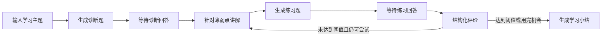

# Learning Coach

Learning Coach 是一个用 LangChain 和 LangGraph 构建的开源 AI 学习教练。它不在讲解之后立刻结束，而是继续诊断、出题、评价，并根据学习者的回答决定补讲还是生成小结。

这个仓库与公众号系列共用一套代码。每篇文章都会在现有项目上增加一项可以运行、可以测试的能力。

## 当前实现

项目已经跑通第一条教学工作流：



这条流程包含：

- LangChain 模型统一接口与 Messages
- Pydantic Structured Output
- LangGraph State、Node、Edge 和 Conditional Edge
- 可终止的补救循环
- `interrupt()` 人工输入
- InMemory Checkpointer 与 `thread_id`

## 快速开始

克隆仓库并创建独立环境：

```bash
git clone https://github.com/gtfy12345/learning-coach.git
cd learning-coach
python3 -m venv .venv
source .venv/bin/activate
python -m pip install -r requirements.txt
```

复制环境变量示例：

```bash
cp .env.example .env
```

编辑 `.env`，至少填写模型和密钥：

```dotenv
MODEL_ID=openai:gpt-5-mini
OPENAI_API_KEY=你的密钥
```

然后启动学习教练：

```bash
PYTHONPATH=src python -m learning_coach "LangGraph Reducer"
```

不传主题也可以启动，程序会在命令行中询问：

```bash
PYTHONPATH=src python -m learning_coach
```

如果使用符合 OpenAI Chat Completions 规范的服务，可以在 `.env` 中增加 `OPENAI_BASE_URL` 并填写服务提供的模型名。原生多 Provider、模型能力判断和认证适配会在后续文章中单独实现。

## 运行测试

```bash
python -m pip install -r requirements-dev.txt
PYTHONPATH=src pytest
```

测试使用假的模型响应，不会请求模型 API，也不会产生费用。

## 项目结构

```text
learning-coach/
├── .env.example
├── README.md
├── requirements.txt
├── requirements-dev.txt
├── src/
│   └── learning_coach/
│       ├── __init__.py
│       ├── __main__.py
│       ├── cli.py
│       ├── graph.py
│       ├── model.py
│       ├── nodes.py
│       ├── schemas.py
│       └── state.py
└── tests/
    ├── test_graph.py
    └── test_routing.py
```

- `state.py`：学习过程保存哪些数据。
- `schemas.py`：模型评价必须返回的结构。
- `nodes.py`：诊断、讲解、出题、评价和总结节点。
- `graph.py`：节点之间的固定边、条件边和循环。
- `cli.py`：接收人工回答，并用 `Command` 恢复图执行。

## 系列路线

整个系列只维护这个公开仓库，不创建互不相关的演示项目。

| 篇 | 主题 | 项目新增能力 |
| --- | --- | --- |
| 1 | 从模型调用到学习闭环 | 诊断、讲解、练习、评价和补救 |
| 2 | 多模型、多模态与结构化输出 | 主流 API、OpenAI-compatible 服务及登录适配 |
| 3 | Runnable 与 LCEL | 资料预处理、批量抽取和并行分析 |
| 4 | Context Engineering 与 Middleware | 动态组织教学上下文、工具和预算 |
| 5 | 多模态学习资料摄取 | 读取文档、网页、图片与代码并保留来源 |
| 6 | 自校正 Hybrid RAG | 检索、重排、查询改写与证据质量判断 |
| 7 | GraphRAG 与知识前置图 | 生成概念图谱并定位前置知识缺口 |
| 8 | Tool Calling、ReAct 与代码实践 | 运行代码测试并提供分级提示 |
| 9 | LangGraph 状态图进阶 | 处理并行、重试、缓存和循环终止 |
| 10 | 多 Agent 与任务编排 | 研究、教师、练习与审查 Agent 分工 |
| 11 | 记忆、暂停恢复与 Time Travel | 持久化任务、审批敏感动作和比较旧状态 |
| 12 | 评价、安全与完整交付 | 形成掌握图谱、阶段报告和评估集 |

## 当前边界

- 现在不会读取个人课程、论文或项目代码。
- `InMemorySaver` 只保存当前进程中的状态。
- 评分由模型完成，不能直接等同于真实掌握程度。
- 外层是确定性 Workflow；工具接入后，才会让 Agent 在局部范围内自主选择动作。

## 参与项目

遇到运行问题或希望增加学习场景，可以在 GitHub Issues 中提交可复现信息。提交代码前请先运行测试，并且不要把 `.env`、密钥、私人资料或本地学习记录提交到仓库。

项目采用 [MIT License](LICENSE)。
