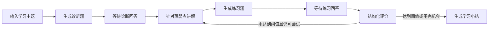
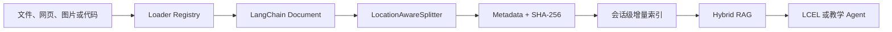
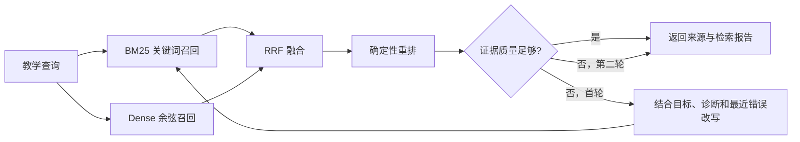
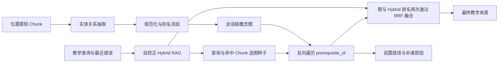
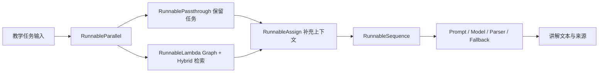

# Learning Coach

Learning Coach 是一个用 LangChain 和 LangGraph 构建的开源 AI 学习教练。它不在讲解之后立刻结束，而是继续诊断、出题、评价，并根据学习者的回答决定补讲还是生成小结。

这个仓库与公众号系列共用一套代码。每篇文章都会在现有项目上增加一项可以运行、可以测试的能力。

## 当前实现

项目已经跑通第一条教学工作流，并完成模型层、LCEL 任务层、Context Engineering、多模态学习资料摄取、自校正 Hybrid RAG 与 GraphRAG 知识前置图扩展：



这条流程包含：

- 可在浏览器完成完整学习闭环的本地 Web MVP
- LangChain 模型统一接口与 Messages
- 主模型与评价模型可使用不同 Provider
- API Key 与官方 CLI 登录两种认证通道
- 基于模型 profile 的图片、Tool Calling 和 Structured Output 能力协商
- Pydantic 结构化诊断与结构化评价
- Provider 原生 JSON Schema 与 Tool Strategy 回退
- 本地图片和图片 URL 的跨 Provider 标准 content blocks
- 由 Prompt、模型和解析器组成的五类 LCEL Runnable
- 教学模型与评价模型的可选完整任务回退
- `RunnableSequence`、`RunnableParallel`、`RunnablePassthrough`、`RunnableAssign` 和 `RunnableLambda` 高级组合
- 默认离线哈希 Embedding、可选 LangChain Provider Embedding 与文档向量缓存
- BM25 与 Dense 双路召回、RRF 融合、确定性重排和带来源讲解
- 证据质量判断、上下文感知查询改写和最多两次的自校正检索
- 可追溯的通道分数、检索尝试与安全降级报告，以及 Runnable 图导出
- 默认离线的实体关系抽取、别名消歧、概念图和可注入结构化模型增强
- 有界前置图遍历、图与 Hybrid RRF 融合及“为什么要先补这个概念”的证据链
- Runnable 的同步、异步、批处理与流式执行，以及 Web SSE、取消和超时
- 默认关闭的 LangSmith 任务追踪标签与安全元数据
- `LearningRuntimeContext` 中一次会话不可变的学习目标与模型/工具预算
- 根据掌握度、最近错误和资料动态生成 Prompt、选择工具与可选高级模型
- `dynamic_prompt`、`wrap_model_call`、`ModelCallLimitMiddleware` 与 `ToolCallLimitMiddleware`
- 不额外调用模型的确定性摘要，以及可展示、无敏感正文的 Context Report
- 面向 PDF、DOCX、PPTX、EPUB、HTML、文本、网页、图片和代码的统一 Loader Registry
- 保留页码、幻灯片、章节、标题与代码行号的 `LocationAwareSplitter`
- 来源 `source_id`、原文 `content_hash` 与 `chunk_hash` 三层 SHA-256
- 支持新增、更新、未变化跳过和 full cleanup 的会话级内存增量索引
- LangGraph State、Node、Edge 和 Conditional Edge
- 可终止的补救循环
- `interrupt()` 人工输入
- InMemory Checkpointer 与 `thread_id`

## 快速开始

克隆仓库并使用 Python 3.10 或更高版本创建独立环境：

```bash
git clone https://github.com/gtfy12345/learning-coach.git
cd learning-coach
python3 -m venv .venv
source .venv/bin/activate
python -m pip install -r requirements.txt
```

复制环境变量示例：

```bash
cp .env.example .env
```

如果使用 API Key 模式，编辑 `.env`，至少填写主模型和对应密钥：

```dotenv
CHAT_MODEL_ID=openai:gpt-5-mini
OPENAI_API_KEY=你的密钥
```

如果希望使用已经登录的官方 CLI，不需要在 `.env` 中填写对应 API Key。先登录，再把模型 ID 切到 CLI Provider：

```bash
PYTHONPATH=src python -m learning_coach auth login codex
```

```dotenv
CHAT_MODEL_ID=codex_cli:default
```

然后启动学习教练：

```bash
PYTHONPATH=src python -m learning_coach "LangGraph Reducer"
```

可以显式说明本次希望达到的学习目标：

```bash
PYTHONPATH=src python -m learning_coach "LangGraph Reducer" \
  --goal "能够独立设计有终止条件的 Reducer 合并流程"
```

也可以重复传入本地学习资料或课程网页。`--image` 仍表示“参与诊断的题图”，`--material` 表示“进入检索索引的学习资料”：

```bash
PYTHONPATH=src python -m learning_coach "LangGraph 条件边" \
  --material ./paper.pdf \
  --material ./course-slides.pptx \
  --material ./src/example.py \
  --material https://docs.example.com/langgraph-routing
```

不传主题也可以启动，程序会在命令行中询问：

```bash
PYTHONPATH=src python -m learning_coach
```

### 启动 Web MVP

Web 页面与 CLI 共用同一套 LangGraph、模型配置和认证方式。已经登录 Codex CLI 时，可以直接启动：

```bash
PYTHONPATH=src python -m learning_coach web --model codex_cli:default
```

然后访问 [http://127.0.0.1:8000](http://127.0.0.1:8000)。如果已经在 `.env` 中配置模型，可以省略 `--model`：

```bash
PYTHONPATH=src python -m learning_coach web
```

页面已经接通以下功能：

- 输入学习主题并生成结构化诊断题
- 输入可选学习目标，让讲解根据掌握度和最近错误动态调整
- 上传一张本地图片参与诊断
- 粘贴纯文本，或上传多份论文、书籍、课件、图片与代码资料
- 输入一个或多个课程网页 URL，并在讲解阶段显示文件名、页码、章节、幻灯片或代码行范围
- 显示本次摄取的新增、更新、跳过和 Chunk 统计
- 显示 Hybrid RAG 尝试次数、证据质量、查询改写和最终来源相关度
- 显示 GraphRAG 概念节点、带方向关系、前置路径、补课原因和来源位置
- 提交诊断回答，查看针对性讲解和迁移练习
- 提交练习答案，查看结构化评分、反馈和知识缺口
- 未达到 80 分时自动补讲并继续出题，最多评价两次
- 完成后展示最终得分与学习小结
- 通过 SSE 增量展示讲解、练习和小结，并可停止当前生成
- 显示当前主模型、评价模型和图片能力，不向浏览器返回 API Key
- 显示当前掌握度、学习摘要以及本轮模型/工具预算使用情况

当前 Web MVP 是本地单进程应用。会话保存在内存中，服务重启后需要重新开始；尚未实现用户账号、数据库、历史记录和公网部署。

后端接口：

| 接口 | 用途 |
| --- | --- |
| `GET /api/health` | 服务健康检查 |
| `GET /api/config` | 返回脱敏后的主/高级/备用模型、Embedding 标识、图片能力和预算上限 |
| `POST /api/sessions` | 使用主题、目标、诊断图片、纯文本、多个 `materials` 文件和换行 `source_urls` 创建会话 |
| `POST /api/sessions/{id}/answers` | 提交回答并恢复 LangGraph 执行 |
| `POST /api/sessions/stream` | 使用相同多模态资料输入流式创建会话 |
| `POST /api/sessions/{id}/answers/stream` | 流式恢复图执行，返回 status、token、sources、retrieval、knowledge_graph、state 和 done 事件 |

两个原 JSON 接口继续保留。浏览器默认使用 POST SSE 接口，通过 Fetch 读取事件流，并用 `AbortController` 停止当前请求。服务端单次图运行默认最多 120 秒，可以调整：

```dotenv
WEB_RUN_TIMEOUT_SECONDS=120
```

如果要让评价使用另一个模型或 Provider：

```dotenv
CHAT_MODEL_ID=openai:gpt-5-mini
ASSESSMENT_MODEL_ID=anthropic:claude-sonnet-4-6
OPENAI_API_KEY=你的 OpenAI API Key
ANTHROPIC_API_KEY=你的 Anthropic API Key
```

如果希望一次任务在主模型调用或输出校验失败后切换到备用模型，可以增加：

```dotenv
CHAT_MODEL_ID=openai:gpt-5-mini
CHAT_FALLBACK_MODEL_ID=anthropic:claude-sonnet-4-6

ASSESSMENT_MODEL_ID=openai:gpt-5-mini
# 未填写时自动继承 CHAT_FALLBACK_MODEL_ID
ASSESSMENT_FALLBACK_MODEL_ID=google_genai:gemini-2.5-flash-lite
```

备用模型是可选配置。LCEL 会对完整的 `Prompt | Model | Parser` 任务使用一次 `with_fallbacks()`：Provider 调用、CLI 调用或输出验证失败都可以触发备用链；主备均失败时保留主链异常，不会无限重试。图片会原样传给备用模型，不会为了降级而静默删除。

### Context Engineering 与 Middleware

第 4 阶段把“每次调用给模型什么上下文”变成了显式策略。`LearningRuntimeContext` 保存本次会话不可变的学习目标、目标掌握度和调用预算；LangGraph State 保存会随学习变化的掌握度、最近三个错误和确定性摘要。两者不会互相覆盖：预算由服务端配置决定，模型输出不能把预算写大。

讲解任务根据这些上下文动态决策：

- `dynamic_prompt` 组合学习目标、当前得分、最近错误、诊断重点和摘要。
- `wrap_model_call` 只开放当前需要的只读工具：有学习资料时开放 `search_study_material`，已经有诊断或反馈时开放 `inspect_learning_progress`。
- 掌握度低于 60，或最近错误达到两个时，可以切换到可选的 `ADVANCED_CHAT_MODEL_ID`；未配置则继续使用主模型。
- `ModelCallLimitMiddleware` 和 `ToolCallLimitMiddleware` 提供硬上限，默认每次讲解最多 3 次模型调用和 2 次工具调用。
- 摘要由确定性规则生成，最多 600 字，不额外消耗模型预算。

```dotenv
# 可选：只在学习者确实卡住时用于讲解
ADVANCED_CHAT_MODEL_ID=openai:gpt-5.4

# 服务端硬上限；Web 客户端不能调高
CONTEXT_MODEL_CALL_LIMIT=3
CONTEXT_TOOL_CALL_LIMIT=2
```

动态工具只读取已经摄取到当前会话内存中的 Chunk 和学习进展，不会在 Agent 循环中自行访问文件、网络、数据库或环境变量。显式提供的网页 URL 只在会话创建前由有界 Loader 下载。官方 CLI 适配器当前明确不支持 Tool Calling，因此使用相同目标、掌握度、最近错误和摘要的 LCEL 兼容路径；这条路径不会伪造工具调用，Context Report 会标记为 `lcel`。

### 多模态学习资料摄取

第 5 阶段把“资料”从一个纯文本字符串升级为一条明确的数据管线：



Loader 统一输出 `Document(page_content, metadata)`，不同格式负责提供不同的原始位置：

| 资料类型 | 支持格式 | 保留的位置 |
| --- | --- | --- |
| 论文与书籍 | PDF、EPUB | PDF 页码、EPUB 章节 |
| 课程文档 | DOCX、PPTX、HTML、TXT、Markdown | 段落、标题、幻灯片或文档位置 |
| 网页 | 明确提交的 http/https URL | 最终 URL 与页面标题 |
| 图片 | PNG、JPEG、GIF、WebP | 文件名、尺寸及视觉模型生成的可见文字/图表描述 |
| 代码 | Python、JS/TS、Java、Go、Rust、C/C++、Shell、SQL、YAML 等 | 文件名、语言与起止行 |

`LocationAwareSplitter` 默认按 1,000 字符和 150 字符重叠切分，并在通用文本中优先保留段落与中英文句子边界，在代码中优先保留行边界。每个 Chunk 都包含原始位置、`char_start`、`char_end` 和稳定 `chunk_index`。

增量索引使用三类哈希：

- `source_id = sha256(source_key)`：识别同一逻辑文件或 URL。
- `content_hash = sha256(raw input)`：判断来源内容是否变化。
- `chunk_hash = sha256(source_id + location + normalized text)`：去重并识别 Chunk。

同一来源和 `content_hash` 再次摄取时标记为 skipped；同名来源内容变化时只替换该来源；`full` 同步可以删除本轮缺失来源。当前索引只保存在会话内存中，不写入磁盘、SQLite 或外部向量数据库。

安全边界：单份资料最大 10 MiB，默认最多 10 个资料、其中最多 3 张图片，总上传最大 30 MiB；网页响应最大 2 MiB。网页 Loader 只允许 http/https，并对初始 URL、DNS 结果和每次重定向执行 SSRF 检查，拒绝 loopback、私网、链路本地和保留地址。代码只读取，不执行。图片每张最多调用视觉模型一次；主模型没有声明图片能力时明确失败。

### 自校正 Hybrid RAG

第 6 阶段让检索从“一次词面匹配”变成有质量判断、可追溯且必然终止的闭环。多模态摄取生成的 Chunk 同时进入 BM25 关键词召回和 Dense 召回；两路结果通过 RRF 按名次融合，再根据查询覆盖率、完整短语、双通道一致性和通道峰值做确定性重排。



默认配置无需新的 API Key，也不会把资料发送给 Embedding Provider：

```dotenv
EMBEDDING_MODEL_ID=local:hash-v1
```

`local:hash-v1` 是 256 维、确定性的特征哈希向量，适合离线演示、可复现测试和中英文词片段相似度；它不是神经语义模型。希望获得 Provider 语义 Embedding 时，可以显式改成 LangChain 支持的 `provider:model`，并安装对应集成、配置凭据：

```dotenv
EMBEDDING_MODEL_ID=openai:text-embedding-3-small
```

只有显式选择 Provider Embedding 时，查询和资料 Chunk 才可能发送到相应外部服务并产生费用；应先确认供应商的数据处理规则。文档向量按 `embedding_model_id + chunk_hash` 缓存在当前进程内，最多 2,048 条，不写入 State 或浏览器。Provider 调用、向量维度或非有限值异常时，Dense 通道会降级，BM25 仍继续工作；对外报告只记录 `embedding_unavailable`，不回传异常正文、密钥或向量。

每次最多召回 8 个候选并选出 3 个来源。首轮证据不足时，系统把学习主题、诊断重点、反馈、知识缺口、最近错误和目标加入查询，最多改写一次；第二轮无论质量如何都结束。最终 `RetrievalReport` 记录原始/最终查询、是否改写、证据质量、Embedding 标识和每轮候选数量，`StudySource` 记录 BM25、Dense、RRF 与重排分数。Web 只显示尝试次数、质量、是否改写和最终来源相关度，不显示未选中正文或向量。

### GraphRAG 与知识前置图

第 7 阶段在 Hybrid RAG 之上增加教学概念图。系统先从当前会话的 Chunk 中做实体关系抽取，再把显式全称/缩写、Unicode、大小写和代码标识符变体交给别名消歧。当前支持四类带方向关系：`prerequisite_of` 表示“前置概念 → 目标概念”，`defines` 表示定义关系，`part_of` 表示组成关系，`related_to` 表示一般关联；每个节点和关系都保留来源 Chunk ID。



默认 `DeterministicGraphExtractor` 不调用模型或网络。它识别中英文的“是……的前置知识”“学习……前先理解……”“requires”“is a prerequisite for”等显式句式，并从 Markdown 标题和代码标识符补充概念实体。实体规范化会合并 `StateGraph` / `state_graph` 一类高置信变体和“全称（缩写）”显式别名；类型不兼容且没有别名证据的同名实体保持独立，宁可少合并也不制造关系。

项目同时提供可注入的 `StructuredModelGraphExtractor` 和 `ModelAugmentedGraphExtractor`。模型增强只有显式注入才会调用，不新增环境变量，也不会在默认 Web/CLI 路径产生额外模型费用。模型输出必须通过 Pydantic 校验，并且只能引用本轮输入的 Chunk；非法结构、未知 Chunk 或模型异常都会回到离线结果，对外不返回异常正文。

图谱与遍历都有硬上限：每次最多分析 24 个 Chunk、每个读取 4,000 字符，图中最多 80 个节点和 160 条关系；反向 BFS 深度最多 3、最多访问 24 个节点、最多返回 5 条前置路径，并使用 visited 和当前路径集合阻止环。图证据按路径距离、关系置信度和查询匹配排名，再与 Hybrid 排名做 RRF；最终仍最多返回 3 个来源。无有效关系、无种子或图增强失败时，原 Hybrid 来源与检索报告保持可用。

`GraphRAGReport` 只保存安全、有界的节点、关系、种子、扩展节点、路径和来源位置，不保存向量、密钥、异常正文或未选中全文。概念图是从 `StudyChunkRecord` 派生的运行时状态，不回写原文件、Chunk 或增量索引。当前实现不引入图数据库，也不跨会话持久化概念图。

也可以把模型切换到 Google Gemini：

```dotenv
CHAT_MODEL_ID=google_genai:gemini-2.5-flash-lite
GOOGLE_API_KEY=你的 Google API Key
```

LangChain 会根据 `provider:model` 前缀加载对应集成。项目安装了 OpenAI、Anthropic 和 Google GenAI 三个 Provider；其他 Provider 需要自行安装它的 LangChain 集成包。

### 官方 CLI 登录模式

CLI 登录模式调用官方命令完成登录和推理，不读取、解析或复制客户端保存的令牌。模型 ID 决定认证通道：`openai:`、`anthropic:` 和 `google_genai:` 继续使用 API Key；`codex_cli:`、`claude_code:` 和 `gemini_cli:` 使用对应 CLI 已保存的登录会话。

| 模型 ID 前缀 | 官方程序 | 登录命令 | 结构化输出 |
| --- | --- | --- | --- |
| `codex_cli:` | Codex CLI | `python -m learning_coach auth login codex` | `codex exec --output-schema` |
| `claude_code:` | Claude Code | `python -m learning_coach auth login claude` | `claude --json-schema` |
| `gemini_cli:` | Gemini CLI | `python -m learning_coach auth login gemini` | JSON 提示词、Pydantic 校验和一次纠错重试 |

示例配置：

```dotenv
# 使用 Codex 登录会话完成诊断、教学和出题
CHAT_MODEL_ID=codex_cli:default

# 使用 Claude 登录会话完成结构化评价
ASSESSMENT_MODEL_ID=claude_code:sonnet

# 单次 CLI 调用超时，单位为秒
CLI_MODEL_TIMEOUT_SECONDS=300
```

也可以让两种角色都使用同一个登录会话：

```dotenv
CHAT_MODEL_ID=claude_code:sonnet
# ASSESSMENT_MODEL_ID 未填写时自动复用主模型
```

Codex 与 Claude Code 支持非交互状态检查和退出：

```bash
PYTHONPATH=src python -m learning_coach auth status codex
PYTHONPATH=src python -m learning_coach auth logout codex

PYTHONPATH=src python -m learning_coach auth status claude
PYTHONPATH=src python -m learning_coach auth logout claude
```

Gemini CLI 的 Google 登录由交互式 `/auth` 界面管理，目前没有不会产生模型请求的独立 `status` 命令，也没有独立的 `logout` 子命令。因此 Learning Coach 只负责启动官方界面，不会通过读取或删除 `~/.gemini` 文件来伪造状态或强制退出。

CLI 模式的执行边界：

- 子进程会移除对应 Provider 的 API Key 环境变量，保证确实使用 CLI 登录会话。
- 每次调用使用临时工作目录，不加载本项目的 `AGENTS.md`、`CLAUDE.md` 或 `GEMINI.md`。
- Codex 使用只读 sandbox、禁止审批并关闭会话持久化；Claude Code 使用 safe mode，并关闭会话持久化。
- 没有图片时 Claude Code 禁用工具；发送本地图片时只开放 `Read`。
- CLI 模式不主动下载图片 URL，只支持 `--image` 指向的本地图片；API Key 模式仍支持本地图片和图片 URL。
- CLI 订阅额度、可选模型和服务可用性由对应官方客户端与账号决定，不等同于 Provider API 配额。

### OpenAI-compatible 服务

符合 OpenAI Chat Completions 规范的服务继续使用 `openai:` 前缀，并配置 endpoint：

```dotenv
CHAT_MODEL_ID=openai:你的模型名
ASSESSMENT_MODEL_ID=openai:你的模型名
OPENAI_BASE_URL=https://example.com/v1
OPENAI_API_KEY=服务提供的密钥
```

兼容服务通常没有 LangChain model profile。它支持 Tool Calling 时，默认的 `auto` 会采用 Tool Strategy；如果服务明确支持原生 JSON Schema，可以设置：

```dotenv
STRUCTURED_OUTPUT_STRATEGY=native
```

可选值为 `auto`、`native` 和 `tool`。`auto` 优先使用模型 profile 声明的原生 Structured Output，否则回退到 function calling；`gemini_cli:` 会使用适配器明确声明的 `prompt_json` 路径，并通过 Pydantic 校验和一次纠错重试完成结构化输出。

### LCEL Runnable 任务层

`runnables.py` 把每次模型任务拆成相同的三段：Prompt 负责把普通字典转换为 Messages，模型套件处理 Provider 与结构化能力差异，输出解析器把结果固定成 `str`、`Diagnostic` 或 `Assessment`。LangGraph 节点只负责从 State 取值、调用任务和写回局部更新。

```python
from learning_coach.model import create_model_suite
from learning_coach.runnables import LearningCoachRunnables

tasks = LearningCoachRunnables.from_models(create_model_suite())

questions = tasks.quiz.batch(
    [
        {"topic": "LCEL", "explanation": "Runnable 可以顺序组合。"},
        {"topic": "LangGraph", "explanation": "StateGraph 负责跨步骤状态。"},
    ]
)
```

五类任务都实现 Runnable 统一接口，可以使用 `invoke`、`ainvoke`、`batch` 和 `stream`。不支持原生分块的官方 CLI 模型会退化为一个完整文本块；支持流式的 LangChain Chat Model 可以逐块产生内容。

教学 Runnable 不是孤立示例。用户提供纯文本或多模态资料后，它会在内存中完成以下组合：



GraphStudyRetriever 先执行原有 Hybrid Retriever，再用概念图扩展前置证据，同时兼容原来最多 50,000 字的粘贴文本。LCEL 路径与讲解 Agent 工具共享同一个 Retriever；最终来源、检索报告和 GraphRAG 报告写入 `GroundedTeaching`、LangGraph State，并通过 Web JSON/SSE 返回。

可以导出任一任务的 Mermaid 组合图：

```python
print(tasks.draw_mermaid("teaching"))
```

放回 LangGraph 后，图仍负责诊断、人工回答、补救循环和总结的执行顺序。文本节点通过 LangGraph custom stream 发出 `status`、`token` 和 `sources`，完整内容聚合完成后才写入 State；浏览器取消时不会把半截讲解写进节点状态。

### 可选 LangSmith 追踪

Runnable 已携带稳定的任务名、`learning-coach` 标签和不含正文的显式 metadata。追踪默认关闭；需要时设置：

```dotenv
LANGSMITH_TRACING=true
LANGSMITH_API_KEY=你的 LangSmith API Key
LANGSMITH_PROJECT=learning-coach
```

项目不会主动把学习资料、图片 base64、学习者回答、Prompt、模型输出或密钥复制进 metadata。不过，LangSmith 是否记录模型输入输出仍由你自己的追踪与隐私配置决定；粘贴私人资料前请先确认该配置。

### 图片输入

诊断阶段可以同时发送本地图片或图片 URL，`--image` 可以重复使用：

```bash
PYTHONPATH=src python -m learning_coach "解释这张状态图" \
  --image ./state-graph.png \
  --image https://example.com/second-diagram.png
```

本地图片会被编码成 base64 标准 content block，支持 PNG、JPEG、GIF 和 WebP，单张最大 10 MiB。`IMAGE_INPUT_POLICY=auto` 默认只允许 profile 明确声明视觉能力的模型；对确实支持图片但没有 profile 的兼容服务，可以显式设置 `IMAGE_INPUT_POLICY=allow`。

### 认证边界

项目支持两条明确分开的认证路径：API Provider 通过 `OPENAI_API_KEY`、`ANTHROPIC_API_KEY`、`GOOGLE_API_KEY` 等官方环境变量调用；CLI Provider 通过官方可执行程序使用它自己管理的登录会话。Learning Coach 不读取令牌文件，也不会把 Codex、Claude Code 或 Gemini CLI 的令牌取出后塞进 LangChain SDK。

## 运行测试

```bash
python -m pip install -r requirements-dev.txt
PYTHONPATH=src pytest
```

测试使用假的模型响应，不会请求模型 API，也不会产生费用。

## 项目结构

```text
learning-coach/
├── .env.example
├── README.md
├── requirements.txt
├── requirements-dev.txt
├── src/
│   └── learning_coach/
│       ├── __init__.py
│       ├── __main__.py
│       ├── auth.py
│       ├── cli.py
│       ├── cli_models.py
│       ├── context.py
│       ├── graph.py
│       ├── hybrid_rag.py
│       ├── ingestion.py
│       ├── knowledge_graph.py
│       ├── loaders.py
│       ├── media.py
│       ├── middleware.py
│       ├── model.py
│       ├── nodes.py
│       ├── retrieval.py
│       ├── runnables.py
│       ├── schemas.py
│       ├── static/
│       │   ├── app.js
│       │   ├── index.html
│       │   └── styles.css
│       ├── state.py
│       └── web.py
└── tests/
    ├── test_auth.py
    ├── test_cli.py
    ├── test_cli_models.py
    ├── test_context.py
    ├── test_graph.py
    ├── test_hybrid_rag.py
    ├── test_ingestion.py
    ├── test_knowledge_graph.py
    ├── test_loaders.py
    ├── test_media.py
    ├── test_middleware.py
    ├── test_model.py
    ├── test_retrieval.py
    ├── test_routing.py
    └── test_web.py
```

- `state.py`：学习过程、掌握度、最近错误、摘要和结构化诊断信息保存哪些数据。
- `context.py`：定义 Runtime Context、预算校验、掌握度分层、最近错误和确定性摘要。
- `ingestion.py`：定义资料输入、Metadata、位置感知 Splitter、SHA-256 和会话级增量索引。
- `loaders.py`：解析 PDF、Office、EPUB、HTML、网页、图片、文本与代码并输出 LangChain Document。
- `hybrid_rag.py`：实现本地/Provider Embedding、BM25、Dense、RRF、重排、质量判断和有界查询改写。
- `knowledge_graph.py`：实现实体关系抽取、别名消歧、概念图、有界前置遍历、图证据排名和 GraphRAG 包装器。
- `middleware.py`：动态 Prompt、工具筛选、模型路由与有界讲解 Agent。
- `schemas.py`：诊断和评价必须返回的 Pydantic 结构。
- `nodes.py`：诊断、讲解、出题、评价和总结节点。
- `runnables.py`：把 Prompt、模型、解析器和有限回退组合成可复用 LCEL 任务。
- `retrieval.py`：把结构化资料 Chunk 和原有粘贴纯文本适配到共享 Hybrid Retriever。
- `graph.py`：节点之间的固定边、条件边和循环。
- `media.py`：把本地图片或 URL 转成跨 Provider 标准 content block。
- `model.py`：创建主模型和评价模型，并协商结构化输出与图片能力。
- `auth.py`：把登录、状态和退出操作委托给官方 CLI。
- `cli_models.py`：把 Codex、Claude Code 和 Gemini CLI 适配成现有节点可调用的模型对象。
- `cli.py`：接收人工回答，并用 `Command` 恢复图执行。
- `web.py`：提供本地 FastAPI 页面、多资料摄取 API、图片上传和 Graph 恢复协议。
- `static/`：浏览器端学习界面、进度状态和交互逻辑。

## 系列路线

整个系列只维护这个公开仓库，不创建互不相关的演示项目。

| 篇 | 主题 | 项目新增能力 |
| --- | --- | --- |
| 1 | 从模型调用到学习闭环 | 诊断、讲解、练习、评价和补救 |
| 2 | 多模型、多模态与结构化输出 | 主流 API、OpenAI-compatible 服务及登录适配 |
| 2.5 | Web MVP | FastAPI、本地学习页面、图片上传和浏览器会话恢复 |
| 3 | Runnable 与 LCEL | 高级组合、统一执行接口、内存 RAG、SSE、超时取消和追踪 |
| 4 | Context Engineering 与 Middleware | Runtime Context、动态 Prompt/Tools/Model、摘要和预算 |
| 5 | 多模态学习资料摄取 | Loader、Splitter、Metadata、Hash、增量索引及文件/网页/图片/代码来源位置 |
| 6 | 自校正 Hybrid RAG | 检索、重排、查询改写与证据质量判断 |
| 7 | GraphRAG 与知识前置图 | 实体关系抽取、别名消歧、有界图遍历、图/向量融合和可追溯前置解释 |
| 8 | Tool Calling、ReAct 与代码实践 | 运行代码测试并提供分级提示 |
| 9 | LangGraph 状态图进阶 | 处理并行、重试、缓存和循环终止 |
| 10 | 多 Agent 与任务编排 | 研究、教师、练习与审查 Agent 分工 |
| 11 | 记忆、暂停恢复与 Time Travel | 持久化任务、审批敏感动作和比较旧状态 |
| 12 | 评价、安全与完整交付 | 形成掌握图谱、阶段报告和评估集 |

## 当前边界

- 诊断图片和资料图片是两个显式输入：前者只进入诊断，后者由视觉模型生成可检索描述；扫描 PDF 不会自动逐页 OCR。
- 只读取用户明确上传或通过 `--material`/`source_urls` 提交的资料，不会扫描目录、递归爬站或自动读取个人文件。
- 增量索引只存在于当前会话内存，不写入磁盘，也不能跨服务重启复用；持久化语料库和向量索引尚未实现。
- 网页 Loader 解析静态 HTML，不执行页面 JavaScript；复杂排版、公式和受密码保护文档可能无法完整提取。
- `InMemorySaver` 只保存当前进程中的状态。
- Web MVP 目前只面向本机使用，没有用户账号、数据库、跨进程恢复或公网部署。
- 评分由模型完成，不能直接等同于真实掌握程度。
- model profile 可能缺失或过期；兼容端点需要通过策略配置显式确认能力。
- LCEL fallback 只在任务抛出异常时切换一次，不做负载均衡，也不会根据答案质量自动换模型。
- 高级教学模型只根据显式掌握度和最近错误切换；它不是自动质量评审，也不会改变评价模型。
- CLI Provider 不支持 Tool Calling 时走 LCEL 兼容路径；只有 profile 明确声明工具能力的 `BaseChatModel` 才进入局部 Agent 循环。
- Context Report 记录模式、工具名和调用计数，不保存资料正文或学习者回答；掌握度仍来自模型评价，不能视为客观测量。
- 默认 `local:hash-v1` 是离线特征哈希，不等同于神经语义 Embedding；语义质量取决于显式选择的 Provider 模型。
- Hybrid RAG 只检索当前会话内存中的 Chunk；候选上限为 8、最终来源上限为 3、检索上限为两次，不会自动扩展到外部知识库。
- 确定性质量阈值是检索启发式指标，不保证资料事实正确，也不能替代人工核验；证据不足的第二轮仍会按上限终止。
- 默认 GraphRAG 只识别显式句式、标题和代码标识符，可能漏掉隐含关系；模型增强只有显式注入才启用，并仍需人工核验抽取关系。
- 概念图只存在于当前会话 State，不引入图数据库；前置解释表示“资料声明了这条依赖路径”，不等同于系统客观测得了学习者掌握状态。
- SSE 取消依赖本地请求断开传播，不是跨进程任务取消协议；超时只约束单次 Web 图运行。
- CLI Provider 依赖本机已安装且已登录的官方程序；Gemini CLI 的 schema 回退弱于原生 Structured Output。
- CLI 登录模式只接受本地图片，不下载远程图片 URL。
- 外层仍是确定性 Workflow；Agent 只在讲解任务内部从两个只读工具中选择，并受到模型/工具预算和 LangGraph 补救次数的双重上限。

## 参与项目

遇到运行问题或希望增加学习场景，可以在 GitHub Issues 中提交可复现信息。提交代码前请先运行测试，并且不要把 `.env`、密钥、私人资料或本地学习记录提交到仓库。

项目采用 [MIT License](LICENSE)。
