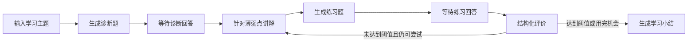
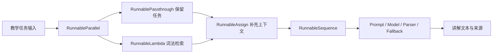

# Learning Coach

Learning Coach 是一个用 LangChain 和 LangGraph 构建的开源 AI 学习教练。它不在讲解之后立刻结束，而是继续诊断、出题、评价，并根据学习者的回答决定补讲还是生成小结。

这个仓库与公众号系列共用一套代码。每篇文章都会在现有项目上增加一项可以运行、可以测试的能力。

## 当前实现

项目已经跑通第一条教学工作流，并完成模型层与 LCEL 任务层扩展：



这条流程包含：

- 可在浏览器完成完整学习闭环的本地 Web MVP
- LangChain 模型统一接口与 Messages
- 主模型与评价模型可使用不同 Provider
- API Key 与官方 CLI 登录两种认证通道
- 基于模型 profile 的图片、Tool Calling 和 Structured Output 能力协商
- Pydantic 结构化诊断与结构化评价
- Provider 原生 JSON Schema 与 Tool Strategy 回退
- 本地图片和图片 URL 的跨 Provider 标准 content blocks
- 由 Prompt、模型和解析器组成的五类 LCEL Runnable
- 教学模型与评价模型的可选完整任务回退
- `RunnableSequence`、`RunnableParallel`、`RunnablePassthrough`、`RunnableAssign` 和 `RunnableLambda` 高级组合
- 基于用户粘贴文本的确定性内存检索、带来源讲解和 Runnable 图导出
- Runnable 的同步、异步、批处理与流式执行，以及 Web SSE、取消和超时
- 默认关闭的 LangSmith 任务追踪标签与安全元数据
- LangGraph State、Node、Edge 和 Conditional Edge
- 可终止的补救循环
- `interrupt()` 人工输入
- InMemory Checkpointer 与 `thread_id`

## 快速开始

克隆仓库并使用 Python 3.10 或更高版本创建独立环境：

```bash
git clone https://github.com/gtfy12345/learning-coach.git
cd learning-coach
python3 -m venv .venv
source .venv/bin/activate
python -m pip install -r requirements.txt
```

复制环境变量示例：

```bash
cp .env.example .env
```

如果使用 API Key 模式，编辑 `.env`，至少填写主模型和对应密钥：

```dotenv
CHAT_MODEL_ID=openai:gpt-5-mini
OPENAI_API_KEY=你的密钥
```

如果希望使用已经登录的官方 CLI，不需要在 `.env` 中填写对应 API Key。先登录，再把模型 ID 切到 CLI Provider：

```bash
PYTHONPATH=src python -m learning_coach auth login codex
```

```dotenv
CHAT_MODEL_ID=codex_cli:default
```

然后启动学习教练：

```bash
PYTHONPATH=src python -m learning_coach "LangGraph Reducer"
```

不传主题也可以启动，程序会在命令行中询问：

```bash
PYTHONPATH=src python -m learning_coach
```

### 启动 Web MVP

Web 页面与 CLI 共用同一套 LangGraph、模型配置和认证方式。已经登录 Codex CLI 时，可以直接启动：

```bash
PYTHONPATH=src python -m learning_coach web --model codex_cli:default
```

然后访问 [http://127.0.0.1:8000](http://127.0.0.1:8000)。如果已经在 `.env` 中配置模型，可以省略 `--model`：

```bash
PYTHONPATH=src python -m learning_coach web
```

页面已经接通以下功能：

- 输入学习主题并生成结构化诊断题
- 上传一张本地图片参与诊断
- 粘贴一段可选学习资料，在讲解阶段检索相关片段并显示来源
- 提交诊断回答，查看针对性讲解和迁移练习
- 提交练习答案，查看结构化评分、反馈和知识缺口
- 未达到 80 分时自动补讲并继续出题，最多评价两次
- 完成后展示最终得分与学习小结
- 通过 SSE 增量展示讲解、练习和小结，并可停止当前生成
- 显示当前主模型、评价模型和图片能力，不向浏览器返回 API Key

当前 Web MVP 是本地单进程应用。会话保存在内存中，服务重启后需要重新开始；尚未实现用户账号、数据库、历史记录和公网部署。

后端接口：

| 接口 | 用途 |
| --- | --- |
| `GET /api/health` | 服务健康检查 |
| `GET /api/config` | 返回脱敏后的主/备用模型配置和图片能力 |
| `POST /api/sessions` | 使用主题和可选图片创建学习会话 |
| `POST /api/sessions/{id}/answers` | 提交回答并恢复 LangGraph 执行 |
| `POST /api/sessions/stream` | 使用主题、可选图片和可选纯文本资料流式创建会话 |
| `POST /api/sessions/{id}/answers/stream` | 流式恢复图执行，返回 status、token、sources、state 和 done 事件 |

两个原 JSON 接口继续保留。浏览器默认使用 POST SSE 接口，通过 Fetch 读取事件流，并用 `AbortController` 停止当前请求。服务端单次图运行默认最多 120 秒，可以调整：

```dotenv
WEB_RUN_TIMEOUT_SECONDS=120
```

如果要让评价使用另一个模型或 Provider：

```dotenv
CHAT_MODEL_ID=openai:gpt-5-mini
ASSESSMENT_MODEL_ID=anthropic:claude-sonnet-4-6
OPENAI_API_KEY=你的 OpenAI API Key
ANTHROPIC_API_KEY=你的 Anthropic API Key
```

如果希望一次任务在主模型调用或输出校验失败后切换到备用模型，可以增加：

```dotenv
CHAT_MODEL_ID=openai:gpt-5-mini
CHAT_FALLBACK_MODEL_ID=anthropic:claude-sonnet-4-6

ASSESSMENT_MODEL_ID=openai:gpt-5-mini
# 未填写时自动继承 CHAT_FALLBACK_MODEL_ID
ASSESSMENT_FALLBACK_MODEL_ID=google_genai:gemini-2.5-flash-lite
```

备用模型是可选配置。LCEL 会对完整的 `Prompt | Model | Parser` 任务使用一次 `with_fallbacks()`：Provider 调用、CLI 调用或输出验证失败都可以触发备用链；主备均失败时保留主链异常，不会无限重试。图片会原样传给备用模型，不会为了降级而静默删除。

也可以把模型切换到 Google Gemini：

```dotenv
CHAT_MODEL_ID=google_genai:gemini-2.5-flash-lite
GOOGLE_API_KEY=你的 Google API Key
```

LangChain 会根据 `provider:model` 前缀加载对应集成。项目安装了 OpenAI、Anthropic 和 Google GenAI 三个 Provider；其他 Provider 需要自行安装它的 LangChain 集成包。

### 官方 CLI 登录模式

CLI 登录模式调用官方命令完成登录和推理，不读取、解析或复制客户端保存的令牌。模型 ID 决定认证通道：`openai:`、`anthropic:` 和 `google_genai:` 继续使用 API Key；`codex_cli:`、`claude_code:` 和 `gemini_cli:` 使用对应 CLI 已保存的登录会话。

| 模型 ID 前缀 | 官方程序 | 登录命令 | 结构化输出 |
| --- | --- | --- | --- |
| `codex_cli:` | Codex CLI | `python -m learning_coach auth login codex` | `codex exec --output-schema` |
| `claude_code:` | Claude Code | `python -m learning_coach auth login claude` | `claude --json-schema` |
| `gemini_cli:` | Gemini CLI | `python -m learning_coach auth login gemini` | JSON 提示词、Pydantic 校验和一次纠错重试 |

示例配置：

```dotenv
# 使用 Codex 登录会话完成诊断、教学和出题
CHAT_MODEL_ID=codex_cli:default

# 使用 Claude 登录会话完成结构化评价
ASSESSMENT_MODEL_ID=claude_code:sonnet

# 单次 CLI 调用超时，单位为秒
CLI_MODEL_TIMEOUT_SECONDS=300
```

也可以让两种角色都使用同一个登录会话：

```dotenv
CHAT_MODEL_ID=claude_code:sonnet
# ASSESSMENT_MODEL_ID 未填写时自动复用主模型
```

Codex 与 Claude Code 支持非交互状态检查和退出：

```bash
PYTHONPATH=src python -m learning_coach auth status codex
PYTHONPATH=src python -m learning_coach auth logout codex

PYTHONPATH=src python -m learning_coach auth status claude
PYTHONPATH=src python -m learning_coach auth logout claude
```

Gemini CLI 的 Google 登录由交互式 `/auth` 界面管理，目前没有不会产生模型请求的独立 `status` 命令，也没有独立的 `logout` 子命令。因此 Learning Coach 只负责启动官方界面，不会通过读取或删除 `~/.gemini` 文件来伪造状态或强制退出。

CLI 模式的执行边界：

- 子进程会移除对应 Provider 的 API Key 环境变量，保证确实使用 CLI 登录会话。
- 每次调用使用临时工作目录，不加载本项目的 `AGENTS.md`、`CLAUDE.md` 或 `GEMINI.md`。
- Codex 使用只读 sandbox、禁止审批并关闭会话持久化；Claude Code 使用 safe mode，并关闭会话持久化。
- 没有图片时 Claude Code 禁用工具；发送本地图片时只开放 `Read`。
- CLI 模式不主动下载图片 URL，只支持 `--image` 指向的本地图片；API Key 模式仍支持本地图片和图片 URL。
- CLI 订阅额度、可选模型和服务可用性由对应官方客户端与账号决定，不等同于 Provider API 配额。

### OpenAI-compatible 服务

符合 OpenAI Chat Completions 规范的服务继续使用 `openai:` 前缀，并配置 endpoint：

```dotenv
CHAT_MODEL_ID=openai:你的模型名
ASSESSMENT_MODEL_ID=openai:你的模型名
OPENAI_BASE_URL=https://example.com/v1
OPENAI_API_KEY=服务提供的密钥
```

兼容服务通常没有 LangChain model profile。它支持 Tool Calling 时，默认的 `auto` 会采用 Tool Strategy；如果服务明确支持原生 JSON Schema，可以设置：

```dotenv
STRUCTURED_OUTPUT_STRATEGY=native
```

可选值为 `auto`、`native` 和 `tool`。`auto` 优先使用模型 profile 声明的原生 Structured Output，否则回退到 function calling；`gemini_cli:` 会使用适配器明确声明的 `prompt_json` 路径，并通过 Pydantic 校验和一次纠错重试完成结构化输出。

### LCEL Runnable 任务层

`runnables.py` 把每次模型任务拆成相同的三段：Prompt 负责把普通字典转换为 Messages，模型套件处理 Provider 与结构化能力差异，输出解析器把结果固定成 `str`、`Diagnostic` 或 `Assessment`。LangGraph 节点只负责从 State 取值、调用任务和写回局部更新。

```python
from learning_coach.model import create_model_suite
from learning_coach.runnables import LearningCoachRunnables

tasks = LearningCoachRunnables.from_models(create_model_suite())

questions = tasks.quiz.batch(
    [
        {"topic": "LCEL", "explanation": "Runnable 可以顺序组合。"},
        {"topic": "LangGraph", "explanation": "StateGraph 负责跨步骤状态。"},
    ]
)
```

五类任务都实现 Runnable 统一接口，可以使用 `invoke`、`ainvoke`、`batch` 和 `stream`。不支持原生分块的官方 CLI 模型会退化为一个完整文本块；支持流式的 LangChain Chat Model 可以逐块产生内容。

教学 Runnable 不是孤立示例。用户粘贴资料后，它会在内存中完成以下组合：



词法 Retriever 不需要 Embedding、向量数据库或网络：它对最多 50,000 字的纯文本做稳定切块，同时考虑英文词元与中文连续字符片段，最多返回三个正相关片段。它适合本篇验证 RAG 数据流，但不是语义向量检索的替代品。

可以导出任一任务的 Mermaid 组合图：

```python
print(tasks.draw_mermaid("teaching"))
```

放回 LangGraph 后，图仍负责诊断、人工回答、补救循环和总结的执行顺序。文本节点通过 LangGraph custom stream 发出 `status`、`token` 和 `sources`，完整内容聚合完成后才写入 State；浏览器取消时不会把半截讲解写进节点状态。

### 可选 LangSmith 追踪

Runnable 已携带稳定的任务名、`learning-coach` 标签和不含正文的显式 metadata。追踪默认关闭；需要时设置：

```dotenv
LANGSMITH_TRACING=true
LANGSMITH_API_KEY=你的 LangSmith API Key
LANGSMITH_PROJECT=learning-coach
```

项目不会主动把学习资料、图片 base64、学习者回答、Prompt、模型输出或密钥复制进 metadata。不过，LangSmith 是否记录模型输入输出仍由你自己的追踪与隐私配置决定；粘贴私人资料前请先确认该配置。

### 图片输入

诊断阶段可以同时发送本地图片或图片 URL，`--image` 可以重复使用：

```bash
PYTHONPATH=src python -m learning_coach "解释这张状态图" \
  --image ./state-graph.png \
  --image https://example.com/second-diagram.png
```

本地图片会被编码成 base64 标准 content block，支持 PNG、JPEG、GIF 和 WebP，单张最大 10 MiB。`IMAGE_INPUT_POLICY=auto` 默认只允许 profile 明确声明视觉能力的模型；对确实支持图片但没有 profile 的兼容服务，可以显式设置 `IMAGE_INPUT_POLICY=allow`。

### 认证边界

项目支持两条明确分开的认证路径：API Provider 通过 `OPENAI_API_KEY`、`ANTHROPIC_API_KEY`、`GOOGLE_API_KEY` 等官方环境变量调用；CLI Provider 通过官方可执行程序使用它自己管理的登录会话。Learning Coach 不读取令牌文件，也不会把 Codex、Claude Code 或 Gemini CLI 的令牌取出后塞进 LangChain SDK。

## 运行测试

```bash
python -m pip install -r requirements-dev.txt
PYTHONPATH=src pytest
```

测试使用假的模型响应，不会请求模型 API，也不会产生费用。

## 项目结构

```text
learning-coach/
├── .env.example
├── README.md
├── requirements.txt
├── requirements-dev.txt
├── src/
│   └── learning_coach/
│       ├── __init__.py
│       ├── __main__.py
│       ├── auth.py
│       ├── cli.py
│       ├── cli_models.py
│       ├── graph.py
│       ├── media.py
│       ├── model.py
│       ├── nodes.py
│       ├── retrieval.py
│       ├── runnables.py
│       ├── schemas.py
│       ├── static/
│       │   ├── app.js
│       │   ├── index.html
│       │   └── styles.css
│       ├── state.py
│       └── web.py
└── tests/
    ├── test_auth.py
    ├── test_cli.py
    ├── test_cli_models.py
    ├── test_graph.py
    ├── test_media.py
    ├── test_model.py
    ├── test_retrieval.py
    ├── test_routing.py
    └── test_web.py
```

- `state.py`：学习过程、结构化诊断信息和图片 content blocks 保存哪些数据。
- `schemas.py`：诊断和评价必须返回的 Pydantic 结构。
- `nodes.py`：诊断、讲解、出题、评价和总结节点。
- `runnables.py`：把 Prompt、模型、解析器和有限回退组合成可复用 LCEL 任务。
- `retrieval.py`：对用户粘贴的纯文本做确定性内存切块和词法检索。
- `graph.py`：节点之间的固定边、条件边和循环。
- `media.py`：把本地图片或 URL 转成跨 Provider 标准 content block。
- `model.py`：创建主模型和评价模型，并协商结构化输出与图片能力。
- `auth.py`：把登录、状态和退出操作委托给官方 CLI。
- `cli_models.py`：把 Codex、Claude Code 和 Gemini CLI 适配成现有节点可调用的模型对象。
- `cli.py`：接收人工回答，并用 `Command` 恢复图执行。
- `web.py`：提供本地 FastAPI 页面、学习会话 API、图片上传和 Graph 恢复协议。
- `static/`：浏览器端学习界面、进度状态和交互逻辑。

## 系列路线

整个系列只维护这个公开仓库，不创建互不相关的演示项目。

| 篇 | 主题 | 项目新增能力 |
| --- | --- | --- |
| 1 | 从模型调用到学习闭环 | 诊断、讲解、练习、评价和补救 |
| 2 | 多模型、多模态与结构化输出 | 主流 API、OpenAI-compatible 服务及登录适配 |
| 2.5 | Web MVP | FastAPI、本地学习页面、图片上传和浏览器会话恢复 |
| 3 | Runnable 与 LCEL | 高级组合、统一执行接口、内存 RAG、SSE、超时取消和追踪 |
| 4 | Context Engineering 与 Middleware | 动态组织教学上下文、工具和预算 |
| 5 | 多模态学习资料摄取 | 读取文档、网页、图片与代码并保留来源 |
| 6 | 自校正 Hybrid RAG | 检索、重排、查询改写与证据质量判断 |
| 7 | GraphRAG 与知识前置图 | 生成概念图谱并定位前置知识缺口 |
| 8 | Tool Calling、ReAct 与代码实践 | 运行代码测试并提供分级提示 |
| 9 | LangGraph 状态图进阶 | 处理并行、重试、缓存和循环终止 |
| 10 | 多 Agent 与任务编排 | 研究、教师、练习与审查 Agent 分工 |
| 11 | 记忆、暂停恢复与 Time Travel | 持久化任务、审批敏感动作和比较旧状态 |
| 12 | 评价、安全与完整交付 | 形成掌握图谱、阶段报告和评估集 |

## 当前边界

- 图片目前只进入诊断节点；纯文本资料可以手动粘贴并在内存中切块、检索和显示来源，但还没有文件解析、OCR 或持久化索引。
- 现在不会自动读取个人课程、论文或项目代码，也不会把粘贴资料保存到外部数据库。
- `InMemorySaver` 只保存当前进程中的状态。
- Web MVP 目前只面向本机使用，没有用户账号、数据库、跨进程恢复或公网部署。
- 评分由模型完成，不能直接等同于真实掌握程度。
- model profile 可能缺失或过期；兼容端点需要通过策略配置显式确认能力。
- LCEL fallback 只在任务抛出异常时切换一次，不做负载均衡，也不会根据答案质量自动换模型。
- 当前 Retriever 是确定性词法匹配，不是语义向量检索；没有重排、查询改写或证据质量判断。
- SSE 取消依赖本地请求断开传播，不是跨进程任务取消协议；超时只约束单次 Web 图运行。
- CLI Provider 依赖本机已安装且已登录的官方程序；Gemini CLI 的 schema 回退弱于原生 Structured Output。
- CLI 登录模式只接受本地图片，不下载远程图片 URL。
- 外层是确定性 Workflow；工具接入后，才会让 Agent 在局部范围内自主选择动作。

## 参与项目

遇到运行问题或希望增加学习场景，可以在 GitHub Issues 中提交可复现信息。提交代码前请先运行测试，并且不要把 `.env`、密钥、私人资料或本地学习记录提交到仓库。

项目采用 [MIT License](LICENSE)。
