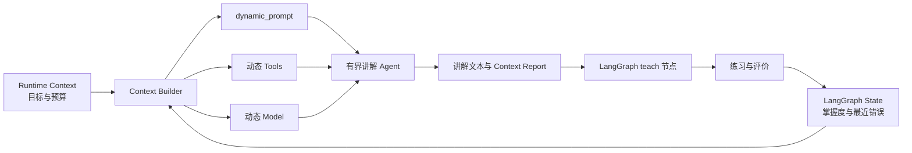

# Context Engineering 与 Middleware 设计文档

> **版本**: 1.0
> **状态**: completed
> **更新日期**: 2026-08-13

## 1 概述

本设计在现有 LCEL 单任务组合与 LangGraph 学习闭环之间增加显式的 Context Engineering 层。每次模型调用不再只接收固定 Prompt，而是根据学习目标、掌握度、最近错误、资料命中和运行预算组装恰当的上下文。

LangGraph 继续负责诊断、暂停恢复、评分、补救循环与终止；LCEL 继续负责确定性的任务组合；LangChain Agent Middleware 只进入讲解任务内部，用于动态 Prompt、动态 Tools、动态 Model、上下文摘要和调用预算。

## 2 设计目标与非目标

### 2.1 设计目标

- 定义一次运行不可变的 `LearningRuntimeContext`，传递学习目标、目标掌握度和模型/工具预算。
- 从 State 中确定性推导掌握度、最近错误和有界学习摘要，并在每轮评价后更新。
- 使用 `dynamic_prompt` 根据 Runtime Context 与当前学习状态生成教学指令。
- 使用 `wrap_model_call` 动态筛选只读工具，并在低掌握度或连续错误时选择可选高级教学模型。
- 使用 `ModelCallLimitMiddleware` 与 `ToolCallLimitMiddleware` 为讲解 Agent 设置硬上限。
- 在无 Tool Calling 能力的 CLI Provider 上保留同一上下文组装逻辑，并确定性降级为无工具 LCEL 教学链。
- Web 支持填写可选学习目标并展示掌握度、最近错误、摘要和本轮预算使用情况。
- 保持现有 80 分通过阈值、最多两次评价、SSE、`interrupt()`、checkpointer 与 `thread_id` 语义不变。

### 2.2 非目标

- 不增加任意代码执行、文件系统、网络搜索或外部写操作工具。
- 不增加数据库、跨会话长期记忆或用户画像。
- 不改变评分阈值、最大补救次数和 State 持久化方式。
- 不让模型自行决定学习流程边、通过条件或循环次数。
- 不把运行时密钥、资料正文、学习者答案或完整 Prompt 写入显式追踪元数据。

## 3 架构设计



讲解 Agent 只提供两个本地只读工具：`search_study_material` 检索当前会话粘贴资料，`inspect_learning_progress` 返回结构化掌握度和最近错误。Middleware 在每次模型调用前根据资料是否存在、掌握度和预算动态暴露工具，而不是把全部工具永久塞入上下文。

无 Tool Calling 能力时，不创建开放式工具循环；同一个 Context Builder 把检索结果、掌握度、最近错误和预算说明直接装配进现有 LCEL Prompt。该兼容路径仍输出相同的 `GroundedTeaching` 和 Context Report。

## 4 接口定义

### 4.1 Runtime Context

```python
@dataclass(frozen=True)
class LearningRuntimeContext:
    learning_goal: str
    target_mastery: int = 80
    model_call_limit: int = 3
    tool_call_limit: int = 2
```

Runtime Context 是调用期输入，不写回声明式 State。CLI 与 Web 在图的 `context` 参数中传入；未提供学习目标时使用“掌握主题：{topic}”。预算必须是有界正整数，并由服务端配置限定，而不是交给浏览器任意放大。

### 4.2 State 与输出契约

`LearningState` 新增以下持久字段：

- `learning_goal: str`：规范化后的学习目标，供暂停恢复和页面展示。
- `mastery_level: int`：0 到 100；诊断后初始为 0，每次评价后更新为最新结构化得分。
- `recent_errors: list[str]`：最近最多 3 个非空知识缺口，去重并按时间保留。
- `context_summary: str`：由确定性规则生成的有界学习摘要，不额外调用模型。
- `context_report: dict[str, Any]`：最近一次讲解实际使用的模型层级、工具、预算和裁剪结果。

模型调用次数和工具调用次数属于单次讲解 Agent 的运行报告，不作为用户可编辑的声明式预算源。Runtime Context 才是预算真理源。

### 4.3 动态 Prompt、Tools 与 Model

- Prompt 总是包含学习目标、主题、当前掌握度、最近错误、诊断信息和摘要。
- `search_study_material` 仅在有资料且工具预算大于 0 时开放。
- `inspect_learning_progress` 在已有诊断回答、反馈或错误记录且工具预算大于 0 时开放。
- 可选 `ADVANCED_CHAT_MODEL_ID` 只在 `mastery_level < 60` 或最近错误不少于 2 个时使用；未配置或不兼容工具时继续使用主模型。
- 动态模型切换只影响讲解 Agent，不改变诊断、评价和总结角色模型。

### 4.4 摘要与预算

学习摘要不使用额外 LLM 调用，按固定模板从目标、掌握度、最近错误和最新反馈生成，最多 600 字。资料检索片段和 Prompt 字段均受现有长度限制。

讲解 Agent 每次运行最多 3 次模型调用和 2 次工具调用，默认值可通过 `CONTEXT_MODEL_CALL_LIMIT` 与 `CONTEXT_TOOL_CALL_LIMIT` 调低或在安全范围内调整。超过上限时抛出可识别错误，绝不无限循环。

## 5 数据流与兼容性

1. Web/CLI 规范化学习目标，创建 State，并把不可变预算作为图 Runtime Context 传入。
2. 诊断节点保留现有结构化输出。
3. 收集诊断回答后初始化摘要；讲解节点构建 `TeachingContext`。
4. 支持工具的模型进入 Middleware Agent；不支持工具的模型进入兼容 LCEL 链。
5. 讲解完成后写回 `explanation`、`sources` 和 `context_report`。
6. 评价节点更新 `mastery_level`、`recent_errors` 和 `context_summary`。
7. 补救讲解自动读取最新状态；通过或次数用尽后照常总结。

现有调用方不传学习目标时保持兼容；新增 JSON 字段均有默认值。现有 `LearningCoachRunnables` 公开任务接口继续存在。

## 6 错误处理与安全边界

- Runtime Context 数值非法时在图运行前给出清晰错误，不静默修正为无限预算。
- Tool Calling 不可用时走确定性兼容路径，不伪造工具调用。
- 动态高级模型失败后仍受现有完整任务 fallback 约束，不增加无界重试。
- 工具只读取函数参数中的内存资料和状态快照，不访问环境变量、文件、网络或跨会话 Store。
- `context_report` 只记录名称、布尔值和计数，不记录回答、资料正文或密钥。
- Web SSE 取消和超时继续传播，不把半截讲解写入 State。

## 7 验收标准

| ID | 场景 | Given | When | Then | Phase |
|----|------|-------|------|------|-------|
| C-1 | Runtime Context | 用户未提供或提供学习目标 | 创建 CLI/Web 会话 | 目标被规范化，预算有界并在暂停恢复时稳定 | Phase 1 |
| C-2 | 动态上下文 | State 含不同分数与错误 | 构建教学上下文 | Prompt、摘要与报告反映目标、掌握度和最近错误 | Phase 1 |
| C-3 | 动态工具 | 有/无资料及不同学习阶段 | Middleware 处理模型请求 | 只暴露当前需要且预算允许的只读工具 | Phase 2 |
| C-4 | 动态模型 | 掌握度低或连续出错 | 执行讲解 | 配置了高级模型时切换，否则使用主模型 | Phase 2 |
| C-5 | 有界循环 | 模型持续调用工具 | 达到调用上限 | 运行确定性结束或报错，不无限执行 | Phase 2 |
| C-6 | CLI 兼容 | CLI Provider 不支持工具 | 执行完整流程 | 使用相同上下文的 LCEL 降级路径完成讲解 | Phase 2 |
| C-7 | Web 展示 | 浏览器完成一轮评价 | 返回 SessionView / SSE | 展示目标、掌握度、错误、摘要与安全预算报告 | Phase 3 |
| C-8 | 回归兼容 | 旧客户端不传新字段 | 运行原 JSON/SSE 接口 | 原学习闭环、阈值、次数和响应字段继续可用 | Phase 3 |

## 8 设计决策记录

- **D-1：Middleware 只进入讲解任务。** 讲解最需要检索和动态教学策略；外层学习流程继续保持确定性。
- **D-2：采用 Agent Middleware，但限定只读工具。** 既覆盖正式 Middleware 生命周期，也不提前引入第 8 篇的代码执行与 ReAct 工具集。
- **D-3：Runtime Context 与 State 分离。** 目标和预算是单次会话配置；掌握度、错误和摘要是随学习推进的短期状态。
- **D-4：摘要采用确定性规则。** 当前工作流最多两次评价，额外摘要模型调用会增加成本且挤占预算；仍保留 LangChain Middleware 的生命周期与调用预算能力。
- **D-5：CLI Provider 显式降级。** 官方 CLI 适配器声明不支持 Tool Calling，因此复用动态 Context Builder，而不伪装 Agent 工具能力。
- **D-6：高级模型是可选配置。** 未配置时主模型正常工作，避免为现有用户引入新的必填 Provider。

## 9 待确认事项

无。跨会话长期记忆、外部工具、代码执行和 Hybrid RAG 留给后续独立阶段。

## 10 关联文档

- [LCEL 生产级组合与内存 RAG](./lcel-production-chain-design.md)
- [实施计划](../plan/context-engineering-middleware/implementation.md)
- [项目 README](../../README.md)
