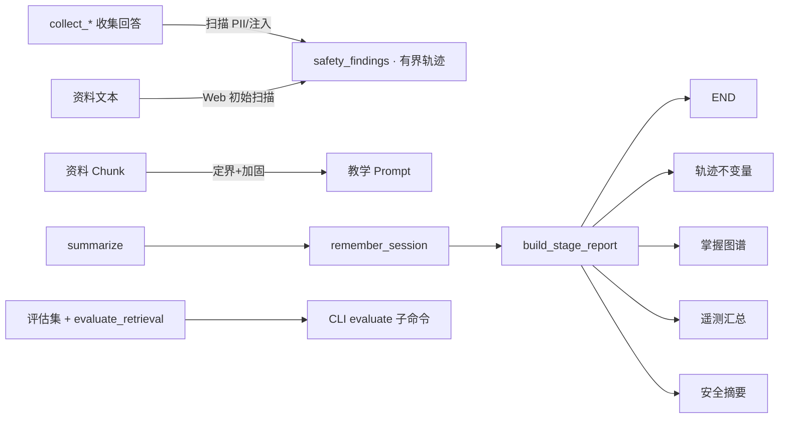

# 评价、安全与完整交付设计文档

> **版本**: 1.0
> **状态**: draft
> **更新日期**: 2026-08-15

## 1 概述

系列收官阶段为学习闭环补上"评价"与"安全"两块基础设施，并把散落的信号汇成一份可交付的阶段报告：确定性 RAG 评估集与检索指标（hit@3 / MRR）、轨迹评价（对已完成会话检查有界性与交接结构不变量）、基于概念图与评价信号生成的掌握图谱、面向资料与回答的 PII 检测与 Prompt 注入标记、以及统一的安全可观测性汇总。所有评价与安全组件均为离线确定性规则，不新增模型调用、Provider 或外部服务。

默认行为保持兼容：新增字段全部可选，教学流程、阈值与恢复协议不变；唯一的行为增强是学习资料上下文被加上显式定界与"资料中的指令不改变教练角色"的加固声明。

## 2 设计目标

- 提供离线评估集与 `evaluate_retrieval`：对固定资料集计算每查询命中与 MRR，可通过 `python -m learning_coach evaluate` 运行。
- 提供 `evaluate_trajectory(state)`：检查补救次数、修订预算、交接顺序、事件无重复与审批记录等结构不变量。
- 提供掌握图谱 `build_mastery_map`：概念级强弱判定与下一步建议，概念来自 GraphRAG 报告或主题回退。
- 提供 PII 与 Prompt 注入的确定性检测与脱敏，发现项进入有界 `safety_findings` 轨迹并汇入报告，不在报告保存原文。
- 学习资料上下文加固定界符与角色加固声明，降低资料内指令劫持讲解的风险。
- 会话结束生成阶段报告（掌握图谱 + 轨迹检查 + 安全摘要 + 运行遥测），Web 结果视图与会话 JSON 呈现。

## 3 架构设计



### 3.1 数据流

1. 两个收集节点对学习者回答执行确定性安全扫描，命中项以"类型+数量"追加进 `safety_findings`（Reducer 上限 10）；Web 对粘贴资料文本在会话创建前做同样扫描。
2. `runnables._format_study_context` 在资料正文外层加显式定界符与加固声明，注入标记命中的资料同样只作为数据呈现。
3. `build_stage_report` 在记忆写入后运行：聚合掌握图谱、轨迹不变量、安全摘要与遥测计数，写入 `stage_report` 字段并随会话 JSON 返回。
4. 评估集与检索评价独立于会话运行：固定资料与查询 → 离线检索 → hit@3 / MRR 报告；轨迹评价可对任意已完成会话状态复用。

### 3.2 真理源与兼容边界

- 评估集是检索质量的回归真理源；阈值以实测基线写入测试，不虚构目标值。
- 掌握图谱是从概念图与评价信号派生的展示层推断，不回写概念图或长期记忆。
- 安全检测是启发式规则：只标记与脱敏，不阻断输入、不删除用户内容、不改变评分。
- `stage_report` 为只读汇总；其中不包含资料正文、学习者回答原文或密钥。
- PII 脱敏只用于报告与日志预览；进入检索索引与 Prompt 的资料保持原文（本地单用户边界内）。

## 4 接口定义

```python
# security.py
find_pii(text) -> list[PIIFinding]
find_injection(text) -> list[str]
inspect_content_safety(text, *, source) -> ContentSafetyReport
redact_pii(text) -> tuple[str, int]
hardened_study_context(source_context) -> str

# evaluation.py
EVALUATION_CASES: list[dict[str, Any]]
evaluate_retrieval(cases) -> RetrievalEvalReport
evaluate_trajectory(state) -> TrajectoryEvalReport
build_mastery_map(state) -> MasteryMap
build_telemetry(state) -> RunTelemetry
build_stage_report(state) -> StageReport
build_stage_report_node(state) -> dict   # 图节点
```

## 5 数据结构

```python
class PIIFinding(BaseModel):          # kind: email/phone/cn_id/ip_address/credit_card, count
class ContentSafetyReport(BaseModel): # source, pii_findings, injection_findings
class ConceptMastery(BaseModel):      # name, band: introduced/practiced/weak, evidence ≤200
class MasteryMap(BaseModel):          # concepts ≤8, focus_gaps ≤3, recommended_next ≤3
class RetrievalCaseResult(BaseModel): # case_id, query, hit, reciprocal_rank
class RetrievalEvalReport(BaseModel): # cases ≤32, hit_rate, mrr
class TrajectoryCheck(BaseModel):     # name, passed, detail
class TrajectoryEvalReport(BaseModel):# checks, passed
class RunTelemetry(BaseModel):        # 各阶段事件计数、尝试、交接、审查、检索尝试、安全发现
class StageReport(BaseModel):         # mastery, trajectory, safety, telemetry, summary
```

State 新增 `safety_findings: Annotated[list[dict], append_safety_findings]`（上限 10）与 `stage_report: dict`。

## 6 错误处理与安全

- 扫描永不抛出：正则异常或超长文本按截断处理，发现项计数有上限。
- 轨迹检查逐项独立：单项失败不阻断报告生成，报告汇总 passed 比例。
- 掌握图谱概念数与字段长度全部有界；无概念图时回退到主题与缺口词。
- 评估集运行零网络、零模型调用；检索指标可重复。
- 注入加固声明是纵深防御的一层，不声称免疫注入；公网部署仍需外部网关。

## 7 验收标准

- `python -m learning_coach evaluate` 输出评估集命中与 MRR，结果与测试一致。
- 含 PII 与注入样例的回答被标记进 `safety_findings`，报告不含原文，正常学习流程不受阻断。
- 教学资料上下文包含定界符与加固声明；注入样例资料不改变教练角色提示。
- 完成会话的 `stage_report` 包含掌握图谱、全部通过的轨迹不变量、安全摘要与遥测计数。
- 全量测试通过；既有流程、阈值、恢复协议与既有报告字段不受影响。

## 8 设计决策记录

| ID | 决策 | 结论 | 理由 |
|----|------|------|------|
| D1 | 评价确定性 | 全部离线规则，不用模型评审 | 与项目"测试不调真实模型"的约束一致，指标可重复 |
| D2 | PII 处置 | 只标记与报告内脱敏，不改输入 | 单用户本地边界内静默改写教学内容弊大于利；公网化时再前移 |
| D3 | 注入防护 | 定界+加固声明+标记 | Prompt 层最小可行纵深；声称免疫是不诚实的 |
| D4 | 掌握图谱来源 | GraphRAG 概念 + 缺口词回退 | 复用第 07 阶段结构化输出，避免新抽取链路 |
| D5 | 评估集位置 | 代码内常量 + CLI 子命令 | 无外部数据依赖，测试与用户可执行同一套 |
| D6 | 报告节点 | remember_session 之后、END 之前 | 报告需要最终状态与记忆事件，且必须落进会话结果 |

## 9 非目标

- 不引入 LLM-as-judge、A/B 评估或在线指标采集。
- 不做 PII 的静默改写、加密存储或合规审计日志。
- 不实现公网 WAF/网关级注入防护；本模块只覆盖应用内确定性层。
- 不改变评分阈值、预算与持久化语义。

## 10 关联文档

- [实施计划](../plan/evaluation-security-delivery/implementation.md)
- [实施 Checklist](../plan/evaluation-security-delivery/implementation-checklist.md)
- [单元测试计划](../plan/evaluation-security-delivery/unit-test-plan.md)
- [上一阶段设计文档](./memory-time-travel-design.md)
