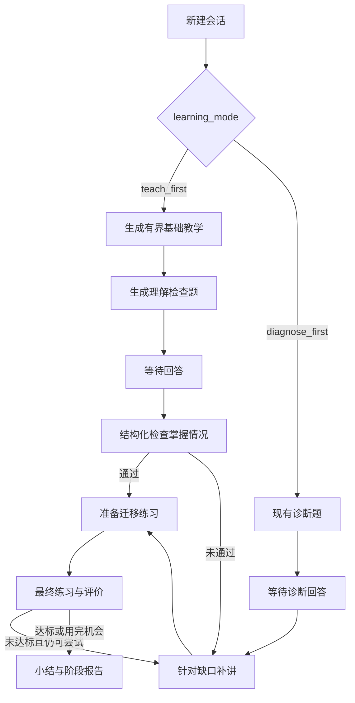

# 先教后测与本地模型设置设计文档

> **版本**: 1.0
> **状态**: completed
> **更新日期**: 2026-08-17

## 1 概述

本 follow-up 将 Learning Coach 的新会话默认入口从“先诊断再讲解”调整为“先提供一段有界教学，再通过理解检查判断掌握情况”，同时保留原“先诊断”模式供用户显式选择。Web 增加独立模型设置页，既能在当前服务进程内配置现有 OpenAI、Anthropic、Google API 模型，也能委托官方 Codex CLI 或 Claude Code 完成登录、状态检查和退出。

API Key 只保存在服务进程内存，不写入 `.env`、数据库、检查点、日志或浏览器存储。模型配置变更只影响之后创建的新会话，已创建会话继续使用其创建时绑定的模型运行时。

## 2 设计目标

- 新会话默认采用 `teach_first`：基础教学 → 理解检查 → 通过后迁移练习，未通过则针对性补讲后再练习。
- 保留 `diagnose_first`，继续执行现有诊断 → 多 Agent 讲解 → 练习流程。
- 最终练习评价继续使用 80 分通过线与最多两次评价，不把理解检查计入最终评价次数。
- 为 Web 增加 `/settings` 页面，支持内存 API 配置与 Codex/Claude 官方 CLI 登录。
- API 模式先选择 Provider 与模型，再执行最小真实连接测试；只有测试成功的配置才能应用。
- 密钥只进不出：服务不回显、不持久化、不记录完整 API Key，也不读取 CLI 令牌文件。
- 使用版本化模型运行时，使配置切换不改变正在进行或恢复中的会话。
- 敏感配置与认证接口只允许回环地址客户端访问。

## 3 架构设计



```mermaid
flowchart LR
    UI[/settings] --> C[RuntimeModelConfigService]
    C -->|API 模式| K[进程内 Secret 配置]
    C -->|CLI 模式| O[官方 codex / claude 命令]
    C --> G[当前模型运行时版本]
    G --> N[新会话]
    N --> B[session_id → graph/runtime 绑定]
    B --> X[后续恢复继续使用原版本]
```

### 3.1 教学模式与兼容性

- `learning_mode` 取值为 `teach_first` 或 `diagnose_first`。
- Web 与新 CLI 会话显式写入模式，默认 `teach_first`。
- 为兼容旧检查点，恢复状态中缺少 `learning_mode` 时按 `diagnose_first` 路由，避免旧会话从中途跳入新流程。
- `teach_first` 的理解检查产生独立的结构化结果与掌握度信号，但不增加最终练习的 `attempts`。
- 理解检查通过后不重复基础补讲；未通过时把缺口写入 `recent_errors`，复用现有有界教学与练习链。

### 3.2 模型设置与运行时隔离

- API 模式支持仓库已经安装的 `openai:`、`anthropic:` 与 `google_genai:` 模型前缀；主模型和评价模型可独立选择，页面只要求填写实际被所选模型使用的 Provider 密钥。
- CLI 模式支持 `codex_cli:` 与 `claude_code:`；页面只委托 `run_auth_action`，不读取认证缓存。
- 配置服务以锁保护“当前配置版本 → 模型套件/图”的原子切换。
- API 测试成功后生成 5 分钟有效、一次性的内存 `test_id`；候选最多保留 8 个并按最旧项淘汰。应用配置只能提升该测试通过的候选运行时，避免绕过测试、内存无界增长或在测试后修改模型。
- 新会话记录创建时的运行时版本；回答、SSE、时间旅行和恢复都从会话绑定中取得同一图与模型。
- 配置失败时保留最后一个可用运行时，不让半成品配置影响服务。

### 3.3 本机安全边界

- `/api/model-config` 与 `/api/model-auth/*` 只接受回环客户端以及同源 JSON 变更请求；非回环或跨源请求返回 403。
- GET 响应只返回模型 ID、认证模式、Provider 和 `api_key_configured` 布尔值。
- PUT 请求中的密钥不进入异常正文、日志、Session State、checkpoint 或 Web 响应。
- API Key 不写入 `.env`、SQLite、localStorage 或 sessionStorage；服务重启后恢复启动参数或环境中的原配置。
- 登录与退出可能打开浏览器或修改官方 CLI 自己的认证缓存，页面需明确这是官方外部流程。

## 4 接口定义

### 4.1 学习会话接口

`POST /api/sessions` 与 `POST /api/sessions/stream` 增加可选字段：

```text
learning_mode = teach_first | diagnose_first
```

新请求缺省为 `teach_first`。会话视图与 SSE 状态返回实际模式；中断 `kind` 对理解检查使用稳定值 `understanding_check`，旧诊断继续使用 `diagnostic`。

### 4.2 模型配置接口

```text
GET /api/model-config
POST /api/model-config/test
PUT /api/model-config
GET /api/model-auth/{codex|claude}/status
POST /api/model-auth/{codex|claude}/login
POST /api/model-auth/{codex|claude}/logout
```

API 模式测试请求包含主模型 ID、可选评价模型 ID，以及当前 Provider 所需 API Key。服务构建候选模型套件并执行最小兼容性请求；成功后返回短期 `test_id`、脱敏摘要和过期时间。PUT 只接受未过期且未使用的成功 `test_id`，原子提升对应候选运行时。CLI 模式请求包含 Provider 与模型 ID；评价模型缺省复用主模型。

真实 API 测试可能产生少量 Provider 费用，页面必须在用户点击前明确提示；自动化测试只使用 fake 模型。

### 4.3 CLI

CLI 新增可选参数：

```text
--learning-mode teach_first|diagnose_first
```

默认 `teach_first`；现有 `auth login/status/logout` 命令保持不变。

## 5 数据结构

```python
LearningMode = Literal["teach_first", "diagnose_first"]

class RuntimeModelConfig(BaseModel):
    auth_mode: Literal["api", "cli"]
    chat_model_id: str
    assessment_model_id: str
    provider: str
    api_key_configured: bool
    version: int

class LearningState(TypedDict, total=False):
    learning_mode: str
    initial_lesson: str
    understanding_check: dict[str, Any]
```

密钥保存在配置服务的私有内存对象中，不进入公开 `RuntimeModelConfig`。

## 6 错误处理

- 不支持的模型前缀、空密钥、CLI 未安装或未登录使用稳定、可操作且不含密钥的错误。
- API 测试失败、超时、结构化输出不兼容或 `test_id` 过期时不应用配置；候选密钥随失败或过期从内存删除。
- 模型套件构建失败时不替换当前运行时；页面显示保存失败。
- 官方 CLI 登录动作在线程池中执行，避免阻塞异步事件循环；重复认证动作串行化。
- 理解检查模型失败沿用节点重试与 Web `run_failed` 脱敏协议。
- 旧状态缺字段、旧客户端不传模式时均有明确兼容默认值。

## 7 验收标准

| ID | 场景 | Given | When | Then | Phase |
|----|------|-------|------|------|-------|
| T-1 | 默认先教后测 | 新建 Web/CLI 会话未指定模式 | 启动会话 | 先返回基础教学，再中断等待理解检查回答 | Phase 1 |
| T-2 | 理解检查通过 | 学习者已回答理解检查且达到目标 | 恢复会话 | 直接进入迁移练习，不重复补讲 | Phase 1 |
| T-3 | 理解检查未通过 | 回答存在明确缺口 | 恢复会话 | 缺口进入最近错误并执行一次针对性教学 | Phase 1 |
| T-4 | 可选先诊断 | 用户选择 `diagnose_first` | 启动会话 | 行为与现有诊断入口一致 | Phase 1 |
| T-5 | 旧检查点兼容 | 状态不含 `learning_mode` | 恢复旧会话 | 按 `diagnose_first` 继续 | Phase 1 |
| M-1 | 内存 API 配置 | 回环客户端提交有效模型与密钥 | 保存配置 | 新会话使用新模型，响应不含密钥 | Phase 2 |
| M-1a | API 先测试后应用 | 用户选择 Provider/模型并填写密钥 | 测试成功后应用 `test_id` | 未测试、测试失败、过期或重复使用均不能切换运行时 | Phase 2 |
| M-2 | 会话模型隔离 | 已有会话后切换配置 | 恢复旧会话并创建新会话 | 两个会话分别使用创建时和最新运行时 | Phase 2 |
| M-3 | CLI 登录 | 本机安装 Codex 或 Claude CLI | 页面触发登录/状态/退出 | 委托官方命令且不读取令牌文件 | Phase 2 |
| M-4 | 非回环拒绝 | 请求来自非回环地址 | 调用敏感接口 | 返回 403 且不执行配置或认证动作 | Phase 2 |
| U-1 | 设置页面 | 用户访问 `/settings` | 选择 API 或 CLI 模式 | 页面显示相应字段、脱敏状态与明确重启边界 | Phase 3 |

## 8 设计决策记录

| ID | 决策 | 结论 | 理由 |
|----|------|------|------|
| D1 | 新默认流程 | `teach_first` | 先建立理解再检查，降低首次使用的考试感 |
| D2 | 旧模式 | 显式保留 `diagnose_first` | 兼容熟悉内容、希望快速定位基础的学习者 |
| D3 | 理解检查计数 | 不占用最终评价次数 | 避免一次低风险检查缩短正式练习机会 |
| D4 | API Key 持久化 | 仅进程内存 | 用户选择 A；避免重新引入 `.env` 明文密钥 |
| D5 | CLI 认证 | 委托官方命令 | 不复制或解析 Codex/Claude 令牌 |
| D6 | 配置切换 | 新会话生效、旧会话绑定原运行时 | 防止学习中途模型与结构化输出契约漂移 |
| D7 | BDD 文档 | 不新增 | 项目没有场景测试基础设施；Graph/Web 集成测试足以形成行为门禁 |
| D8 | API 验证 | 真实最小请求通过后才能应用 | 单纯构造客户端不能证明认证、模型名与结构化输出契约可用 |

## 9 非目标

- 不实现公网多用户账号、RBAC、共享密钥或远程管理控制台。
- 不把 API Key 写入 `.env`、数据库、浏览器存储或操作系统 Keychain。
- 不新增模型 Provider、向量数据库或新的评分阈值。
- 不让 Codex/Claude 登录状态代替 Learning Coach 用户身份。
- 不删除旧诊断模式，不迁移或重写历史检查点。

## 10 关联文档

- [原评价、安全与完整交付设计](./evaluation-security-delivery-design.md)
- [Codex CLI Exec 兼容性设计](./official-cli-login-follow-up-codex-exec-compatibility-design.md)
- [原实施计划](../plan/evaluation-security-delivery/implementation.md)
- [实施计划](../plan/evaluation-security-delivery-follow-up-teach-first-model-settings/implementation.md)
- [单元测试计划](../plan/evaluation-security-delivery-follow-up-teach-first-model-settings/unit-test-plan.md)
- [原交付评估](../reports/2026-08-15-evaluation-security-delivery-assessment.md)
