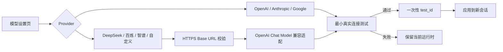

# 国产模型兼容接入与模型页面优化设计文档

> **版本**: 1.0
> **状态**: completed
> **更新日期**: 2026-08-17

## 1 概述

本 follow-up 在现有本机模型设置能力上增加 OpenAI 兼容接入层，内置 DeepSeek、阿里云百炼（通义千问）和智谱 GLM，并提供一个自定义兼容 Provider 供 Kimi、硅基流动等兼容平台使用。同时优化首页模型入口与 `/settings` 页面，使 Provider、模型、Base URL、API Key、连接测试和应用状态形成清晰的一条配置路径。

现有 OpenAI、Anthropic、Google GenAI、Codex CLI 与 Claude Code 行为保持兼容。API Key 继续只保存在服务进程内存；所有 API 配置必须先通过最小真实请求测试，才能应用到之后创建的新会话。

## 2 设计目标

- 使用一套 OpenAI 兼容适配逻辑接入 DeepSeek、通义千问、智谱 GLM 与自定义兼容端点，不增加多套厂商 SDK。
- 由后端维护 Provider 能力与默认端点真理源，前端提供对应的中文名称、推荐模型和快捷预设。
- 主模型与评价模型可以分别选择 Provider 和模型，并只要求实际使用的 Provider 凭据。
- 自定义端点只接受 HTTPS URL，拒绝用户信息、查询串和片段，降低误配与本机敏感地址访问风险。
- 优化首页模型入口、设置页信息层级、加载/成功/失败状态、键盘操作和移动端布局。
- 保持现有一次性 `test_id`、配置版本、会话运行时隔离和秘密不落盘语义。

## 3 架构设计



### 3.1 Provider 注册表

后端使用显式注册表定义 OpenAI 兼容 Provider：

| Provider ID | 展示名称 | 默认 Base URL | 推荐模型 |
|-------------|----------|------------------|----------|
| `deepseek` | DeepSeek | `https://api.deepseek.com` | `deepseek-v4-flash` |
| `dashscope` | 通义千问（阿里云百炼） | `https://dashscope.aliyuncs.com/compatible-mode/v1` | `qwen-plus` |
| `zhipu` | 智谱 GLM | `https://open.bigmodel.cn/api/paas/v4` | `glm-5-turbo` |
| `openai_compatible` | 自定义兼容接口 | 无 | 由用户填写 |

前端预设用于减少输入成本，后端注册表负责允许范围、默认地址和适配行为。前端传入的 Provider ID 与模型 ID 仍使用 `provider:model` 格式，公开运行时摘要因此能保留真实厂商身份，而不是统一显示为 `openai:`。

### 3.2 兼容模型创建

兼容 Provider 在模型创建时拆分为逻辑 Provider、模型名称和连接参数，再以 `model_provider="openai"` 创建 LangChain Chat Model。`api_key` 与 `base_url` 只作为构造参数传入，不写回环境变量。

现有 Provider 继续走原来的 `init_chat_model(provider:model)` 路径。未知 Provider 仍在配置服务入口被拒绝。

### 3.3 配置与状态边界

- `ApiModelConfigInput` 是页面配置请求的真理源，包含模型 ID、按 Provider 分组的 API Key 与可选 Base URL。
- Provider 注册表是内置兼容端点和适配类型的真理源；页面预设不是授权边界。
- `PublicRuntimeModelConfig` 只返回认证模式、模型 ID、Provider、是否配置 Key 与版本，不返回 Key，也不承诺恢复输入框内容。
- Base URL 和 API Key 只进入待测试候选与已构建模型客户端，不写入 `.env`、数据库、浏览器存储、学习状态或 checkpoint。
- 已有 API 调用不传 `base_urls` 时保持兼容；内置国产 Provider 使用默认地址，自定义 Provider 必须显式提供地址。

## 4 接口定义

### 4.1 API 配置测试

`POST /api/model-config/test` 增加可选字段：

```json
{
  "chat_model_id": "deepseek:deepseek-v4-flash",
  "assessment_model_id": "dashscope:qwen-plus",
  "api_keys": {
    "deepseek": "***",
    "dashscope": "***"
  },
  "base_urls": {
    "deepseek": "https://api.deepseek.com",
    "dashscope": "https://dashscope.aliyuncs.com/compatible-mode/v1"
  }
}
```

`base_urls` 只处理当前模型使用的 Provider。标准 Provider 可省略；内置兼容 Provider 可省略并使用默认值；`openai_compatible` 必填。

### 4.2 页面交互

- 首页把模型设置显示为明确的导航动作，并继续展示当前运行时状态。
- 设置页按“API 模型”和“官方 CLI”区分配置方式，默认展开 API 模型。
- 主模型和评价模型均提供 Provider 与模型字段；Provider 变化时自动填入对应推荐模型。
- 凭据区按实际 Provider 动态生成，展示 Provider 名称、密码输入框和兼容端点；相同 Provider 只出现一次。
- 测试期间显示进度；任何字段变化都会使已有测试票据失效；应用成功后清空 Key 输入。
- 页面不使用 `localStorage` 或 `sessionStorage` 保存 Key、Base URL 或测试票据。

## 5 数据结构

```python
ApiProvider = Literal[
    "openai",
    "anthropic",
    "google_genai",
    "deepseek",
    "dashscope",
    "zhipu",
    "openai_compatible",
]

class ApiModelConfigInput(BaseModel):
    chat_model_id: str
    assessment_model_id: str | None
    api_keys: dict[str, SecretStr]
    base_urls: dict[str, str] = {}
```

兼容 Provider 注册项包含默认 Base URL；不创建可持久化的新配置表，也不改变 Learning State。

## 6 错误处理

- 未支持 Provider、缺少当前 Provider 的 API Key 或自定义端点时返回可操作的 422 错误。
- Base URL 只接受 HTTPS，且不得包含用户名、密码、查询参数或片段；错误响应不包含 API Key。
- 连接、认证、模型名或结构化输出验证失败时返回统一脱敏错误，并保留最后一个可用运行时。
- 前端网络错误、验证错误和测试票据失效分别显示在当前配置区域，不以浏览器弹窗打断操作。
- 前端预设与后端注册表出现漂移时，由静态契约测试阻断交付。

## 7 验收标准

| ID | 场景 | Given | When | Then | Phase |
|----|------|-------|------|------|-------|
| D-1 | DeepSeek 预设 | 用户选择 DeepSeek | 填写 Key 并测试 | 使用官方兼容地址和推荐模型完成测试 | Phase 1 |
| D-2 | 多国产 Provider | 主模型与评价模型选择不同国产 Provider | 提交配置 | 服务分别使用对应 Key 与 Base URL 构建模型 | Phase 1 |
| D-3 | 自定义兼容接口 | 用户选择自定义 Provider | 填写 HTTPS 地址、模型和 Key | 测试成功后可应用，非法地址被拒绝 | Phase 1 |
| D-4 | 兼容既有 Provider | 用户继续选择 OpenAI、Anthropic 或 Google | 测试并应用 | 行为与现有设置一致 | Phase 1 |
| U-1 | 动态凭据区 | 用户切换主/评价 Provider | 页面刷新配置字段 | 只显示实际所需 Provider，重复项合并 | Phase 2 |
| U-2 | 测试门禁 | 用户改变任意配置 | 尝试应用 | 必须重新测试，成功后才能应用 | Phase 2 |
| U-3 | 首页入口 | 用户访问首页 | 查看页头 | 能看到当前模型状态并清晰进入模型设置 | Phase 2 |
| U-4 | 响应式与可访问性 | 用户使用窄屏或键盘 | 操作配置页 | 内容不溢出且所有控件具有可识别标签与焦点状态 | Phase 2 |
| S-1 | 秘密边界 | API 测试成功或失败 | 检查响应、磁盘与浏览器存储 | 完整 API Key 均未出现 | Phase 3 |

## 8 设计决策记录

| ID | 决策 | 结论 | 理由 |
|----|------|------|------|
| D1 | 国产 Provider 接入方式 | OpenAI 兼容协议 | 用户选择方案 A；复用现有依赖并降低维护成本 |
| D2 | 首批内置 Provider | DeepSeek、通义千问、智谱 GLM | 官方均提供兼容接口，覆盖主流国内平台 |
| D3 | 其他平台 | 提供自定义兼容 Provider | 避免为每个平台增加 SDK；Kimi、硅基流动等可按兼容地址接入 |
| D4 | 自定义 URL | 仅 HTTPS 且禁止凭据、查询和片段 | 缩小误配置和本机敏感地址访问风险 |
| D5 | 能力验证 | 保持先测试后应用 | 兼容协议不保证结构化输出完全一致，必须实际验证教学工作流所需能力 |
| D6 | 页面范围 | 首页入口与设置页一并优化 | 让模型状态、进入路径与配置任务形成完整体验 |

## 9 非目标

- 不增加厂商原生 SDK、模型列表在线同步或自动计费查询。
- 不承诺每个 OpenAI 兼容模型都支持结构化输出；以连接测试结果为准。
- 不持久化 API Key、Base URL、测试票据或页面表单。
- 不开放公网模型管理、多用户密钥共享或权限系统。
- 不接入本地 HTTP 模型服务；本次自定义端点限定 HTTPS。

## 10 关联文档

- [先教后测与本地模型设置设计](./evaluation-security-delivery-follow-up-teach-first-model-settings-design.md)
- [原 Follow-up 实施计划](../plan/evaluation-security-delivery-follow-up-teach-first-model-settings/implementation.md)
- [本次实施计划](../plan/evaluation-security-delivery-follow-up-teach-first-model-settings-follow-up-domestic-models-ui/implementation.md)
