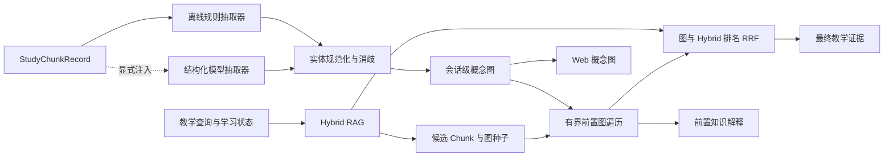

# GraphRAG 与知识前置图设计文档

> **版本**: 1.0
> **状态**: active
> **更新日期**: 2026-08-15

## 1 概述

本模块在现有自校正 Hybrid RAG 之上增加面向教学场景的轻量 GraphRAG：从会话级资料 Chunk 中抽取概念实体与关系，完成别名归并和有界图遍历，再把图相关性与已有关键词、向量结果融合。最终既返回教学证据，也返回“目标概念依赖哪些前置知识、为什么当前需要补它”的可追溯解释。

默认实现完全离线、确定性且无额外模型费用；同时保留可注入的结构化模型抽取器接口，用于显式增强开放文本中的隐含关系。模块不引入图数据库，不改变资料原文，也不把运行时图谱写回摄取索引。

## 2 设计目标

- 从中英文教学资料、标题和代码标识符中抽取有界概念实体。
- 识别 `prerequisite_of`、`part_of`、`related_to` 三类教学关系并保留证据 Chunk。
- 通过 Unicode 规范化、大小写与标识符归一化、显式别名和上下文相似度完成确定性消歧。
- 从当前主题、诊断重点、知识缺口和最近错误选择图种子，反向遍历前置关系。
- 将图遍历排名与现有 Hybrid RAG 最终排名用 RRF 融合，不直接混合不同量纲的原始分数。
- 输出概念图、前置路径、补课原因和来源位置，并让 Web 端可见。
- 无图、抽取失败或模型增强失败时安全回退到现有 Hybrid RAG。
- 所有抽取、遍历、融合和输出都有明确资源上限与循环终止条件。

## 3 架构设计

### 3.1 数据流

1. 资料摄取层继续以 `StudyChunkRecord` 作为唯一原始事实来源。
2. 图谱构建器针对最多 24 个 Chunk 抽取概念和关系，生成运行时 `ConceptGraph`。
3. 消歧器只在规范化名称、显式别名或高置信上下文匹配时合并实体；不确定实体保留为独立节点。
4. Hybrid RAG 先完成原有最多两轮自校正检索。
5. GraphRAG 使用查询概念和 Hybrid 命中 Chunk 中的概念作为种子，按反向 `prerequisite_of` 边做有界 BFS。
6. 图命中的证据 Chunk 形成第二个排名，与 Hybrid 排名做 RRF，最多返回 3 个来源。
7. 概念图、前置路径和原因作为独立 `GraphRAGReport` 写入教学结果与 LangGraph State。

### 3.2 真理源与兼容边界

- `StudyChunkRecord` 及其来源位置是资料事实的唯一真理源。
- `ConceptGraph`、图分数和前置解释均为运行时派生状态，不得写回 Chunk、原文件或增量索引。
- 图报告只保存有界节点、边、路径和 Chunk ID，不保存向量、异常正文、密钥或未选中资料全文。
- `StudySource`、`GroundedTeaching` 和 Web 会话仅增加可选字段；旧调用方缺少图报告时行为不变。
- `retrieve_study_sources` 的列表返回接口保持不变；带报告接口可接收 Hybrid 或 Graph 增强 Retriever。

## 4 接口定义

### 4.1 抽取器接口

`EntityRelationExtractor` 接收有界 `StudyChunkRecord` 序列并返回抽取批次。默认 `DeterministicGraphExtractor` 使用显式教学关系句式、标题、代码标识符和术语候选；`StructuredModelGraphExtractor` 通过注入的 Runnable 返回 Pydantic 结构化结果，调用失败时不影响默认抽取结果。

模型增强不是默认路径，也不新增环境变量。调用方只有显式注入模型抽取器时才产生额外模型请求。

### 4.2 图谱构建接口

`build_concept_graph(chunks, extractor=None)`：

- 限制输入 Chunk 数、单 Chunk 字符数、节点数和关系数。
- 合并同一规范化概念、显式缩写与高置信别名。
- 去重同源同目标同类型关系，合并证据 ID 并保留最高置信度。
- 返回稳定 ID、稳定排序的 `ConceptGraph`。

### 4.3 遍历与解释接口

`find_prerequisite_paths(graph, target_concepts, gap_context)`：

- 只沿 `prerequisite_of` 的反方向查找目标概念依赖项。
- BFS 最大深度 3、最多访问 24 个节点、最多返回 5 条路径。
- 使用 visited 集合防止环；同长度路径按概念 ID 稳定排序。
- 理由由路径、当前知识缺口/最近错误的词面匹配和关系证据组成，不声称模型已经确认学习者掌握情况。

### 4.4 检索融合接口

`GraphStudyRetriever` 包装现有 `HybridStudyRetriever`：

- 先执行现有 Hybrid RAG 和最多一次查询改写。
- 从查询、最终命中与学习上下文选取图种子。
- 按图距离、关系置信度和上下文匹配生成图证据排名。
- 使用 RRF 融合 Hybrid 排名与图排名；图为空时原样返回 Hybrid 结果。
- 最终分数仍归一化到 `[0, 1]`，并在 `RetrievalScore` 可选字段中记录 graph 与 graph_fusion。

## 5 数据结构

### 5.1 ConceptNode

- `concept_id`：规范化名称与类型的稳定 SHA-256。
- `name`：安全展示名称。
- `normalized_name`：用于匹配和消歧的规范名。
- `kind`：`concept|technology|code|abbreviation`。
- `aliases`：最多 8 个别名。
- `chunk_ids`：最多 12 个证据 Chunk ID。

### 5.2 ConceptRelation

- `relation_id`：源、目标、关系类型的稳定 SHA-256。
- `from_concept_id` / `to_concept_id`：方向明确的端点。
- `relation_type`：`prerequisite_of|part_of|related_to`。
- `confidence`：`[0, 1]`。
- `evidence_chunk_ids`：最多 8 个来源 Chunk ID。

`prerequisite_of` 的方向固定为“前置概念 → 目标概念”。

### 5.3 GraphRAGReport

- `extraction_mode`：`deterministic|model_augmented|fallback`。
- `graph_used`：是否实际影响最终检索或生成前置解释。
- `nodes` / `relations`：安全、有界的概念图投影。
- `seed_concepts` / `expanded_concepts`：本次查询使用的图节点。
- `prerequisites`：最多 5 条 `PrerequisiteExplanation`。
- `hybrid_candidates` / `graph_candidates` / `selected_candidates`：融合计数。

## 6 资源、安全与失败处理

| 边界 | 上限/行为 |
|------|-----------|
| 图谱输入 | 最多 24 个 Chunk，每个最多读取 4,000 字符 |
| 图谱大小 | 最多 80 个节点、160 条关系 |
| 遍历 | 深度 3、访问 24 个节点、输出 5 条路径 |
| 最终来源 | 沿用现有最多 3 条 |
| 模型增强 | 仅显式注入；异常、非法结构或超限时退回确定性结果 |
| 无图关系 | 原样返回 Hybrid RAG，不伪造前置解释 |
| 环与自环 | 自环拒绝；遍历 visited 去重；关系数量硬上限 |
| 隐私 | 不输出向量、密钥、本地绝对路径、异常正文或未选中全文 |

## 7 验收标准

| ID | 场景 | Given | When | Then | Phase |
|----|------|-------|------|------|-------|
| G-1 | 实体关系抽取 | 资料含“Reducer 是并行 State 更新的前置知识” | 构建概念图 | 生成稳定实体和 `Reducer → State 更新` 前置边并关联证据 Chunk | 1 |
| G-2 | 实体消歧 | 资料同时含全称、缩写和大小写变体 | 规范化实体 | 高置信别名合并，不确定同名实体不误合并 | 1 |
| G-3 | 有界遍历 | 图中存在多级前置边、分支和环 | 查询目标概念 | 在上限内终止并返回稳定、无重复路径 | 2 |
| G-4 | 图与向量融合 | Hybrid 命中目标说明，图命中前置说明 | 执行 GraphRAG | 最终来源包含有用前置证据并记录融合分数 | 3 |
| G-5 | 无图降级 | 资料没有有效关系或增强器失败 | 执行教学检索 | 来源与报告保持 Hybrid RAG 可用且无伪造路径 | 3 |
| G-6 | 教学解释 | 当前缺口命中前置概念或其路径 | 生成教学上下文 | Prompt、State、SSE 与 Web 都可见“为什么补”及来源位置 | 4 |
| G-7 | 兼容与安全 | 旧文本资料和旧客户端输入 | 运行完整学习流程 | 原接口继续可用，图报告可选且不泄漏敏感内容 | 4 |

## 8 关联文档

- [自校正 Hybrid RAG 设计](./self-corrective-hybrid-rag-design.md)
- [多模态学习资料摄取设计](./multimodal-material-ingestion-design.md)
- [实施计划](../plan/graphrag-prerequisite-graph/implementation.md)
- [单元测试计划](../plan/graphrag-prerequisite-graph/unit-test-plan.md)
