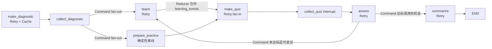

# LangGraph 状态图进阶设计文档

> **版本**: 1.0
> **状态**: draft
> **更新日期**: 2026-08-15

## 1 概述

本模块把现有 LangGraph 学习闭环升级为可在并行与失败场景下稳定运行的状态图：用 Reducer 定义并行分支的显式合并语义，用 `Command` 承担导航与并行 fan-out，用节点级 `RetryPolicy` 处理瞬态模型错误，用节点级 `CachePolicy` 复用纯函数节点结果，并保持原有的有界补救循环终止条件不变。

升级后的图在诊断回答之后并行执行"讲解"和"练习准备"两个分支：讲解依赖模型调用，练习准备是确定性离线操作，两者在练习生成节点汇合。并行分支写同一 State 字段的行为由 Annotated Reducer 显式定义，不再依赖默认覆盖语义。

## 2 设计目标

- 为 `recent_errors` 和并行事件轨迹定义显式 Reducer，让节点只提交增量更新。
- 用 `Command(goto=...)` 替代 `add_conditional_edges`，并在诊断收集节点实现双分支并行 fan-out。
- 把代码练习准备拆分为可与讲解并行的确定性节点，练习生成节点作为 fan-in 汇合点。
- 为五个模型节点挂接有界 `RetryPolicy`，只重试瞬态错误，配置与校验错误快速失败。
- 为纯函数化的诊断节点挂接 `CachePolicy`，相同主题与题图在进程内复用结果。
- 保持补救循环终止条件（分数阈值 80、最多评价 2 次）与 `interrupt()` 暂停恢复协议完全不变。
- 所有新 State 字段可选，原文本学习流程、CLI 与 Web 协议保持兼容。

## 3 架构设计



### 3.1 数据流

1. `collect_diagnostic` 在 `interrupt()` 恢复后返回 `Command(goto=["teach", "prepare_practice"], update=...)`，两个分支在同一 superstep 并行执行。
2. `teach` 生成讲解并追加学习事件；`prepare_practice` 判定练习类型并对代码主题预生成确定性练习；两者只通过 `learning_events` 这个 Reducer 字段产生并行写。
3. `make_quiz` 作为 fan-in 汇合点：优先使用已准备好的练习，文本路径继续依赖讲解结果生成模型练习。
4. `assess` 返回 `Command(goto=...)`：未达到阈值且仍有次数时重入同一并行 fan-out，否则进入 `summarize`。
5. `make_diagnostic` 输出只依赖主题与诊断图片，是纯函数节点，因此可被 CachePolicy 安全复用。

### 3.2 真理源与兼容边界

- `state.py` 是 Reducer 合并语义的真理源；节点不得在返回值里提交"全量覆盖"的 `recent_errors`。
- `route_after_assessment` 仍是补救路由的唯一判定函数，阈值与次数上限不变。
- `LearningRuntimeContext` 仍是预算真理源；重试与缓存策略不改变任何预算语义。
- 缓存只保存节点状态更新，不保存模型对象、密钥或跨进程数据；`InMemoryCache` 与 `InMemorySaver` 同为进程内边界。
- `practice_kind`、`learning_events` 为可选字段；旧调用方不读取它们时行为不变。

## 4 接口定义

### 4.1 State Reducer

```python
recent_errors: Annotated[list[str], merge_recent_errors]
learning_events: Annotated[list[dict[str, Any]], append_learning_events]
```

- `merge_recent_errors(existing, updates)`：把评价节点提交的错误增量并入现有列表，去重、跳过"暂无"类标记并保留最近 3 条。
- `append_learning_events(existing, updates)`：拼接并行分支事件并保留最近 30 条。

### 4.2 Command 导航

```python
collect_diagnostic(state) -> Command  # goto=["teach", "prepare_practice"]
assess(state) -> Command              # goto=["teach", "prepare_practice"] | "summarize"
```

`Command.update` 与原节点返回值同构；`route_after_assessment` 保持纯函数签名不变。

### 4.3 韧性策略模块 `resilience.py`

```python
is_transient_model_error(error) -> bool
default_model_retry_policy() -> RetryPolicy      # max_attempts=2
diagnostic_cache_key(state) -> str               # topic + 图片指纹
node_cache_enabled(environ) -> bool              # GRAPH_NODE_CACHE，默认 true
```

### 4.4 图装配

```python
build_learning_graph(
    model, *,
    checkpointer=None, cache=None,
    retry_policy=None, enable_node_cache=None,
)
```

显式传入的 `cache` 或 `enable_node_cache` 优先于环境变量；默认为环境开关 + `InMemoryCache`。

## 5 数据结构

```python
class LearningEvent(BaseModel):      # extra="forbid"
    node: str                        # teach / prepare_practice / assess
    status: str                      # completed
    detail: str                      # 有界摘要，默认空字符串
```

State 新增 `practice_kind: str`（`"code"` 或 `"text"`）与 `learning_events`；`code_exercise`、`code_tool_trace` 改由 `prepare_practice` 写入，字段结构不变。

## 6 错误处理与安全

- 瞬态判定：内置 `TimeoutError`、`ConnectionError`，以及 RateLimitError、APITimeoutError、APIConnectionError、InternalServerError、ServiceUnavailableError、OverloadedError 类名；其余异常（含 `ValueError`、`interrupt` 冒泡）不重试。
- 重试上限：默认每个节点最多 2 次尝试；与 LCEL 备用链叠加时单节点最多 4 次模型调用，仍有界。
- 循环终止：分数 ≥ 80 或评价次数 ≥ 2 进入总结；整图最长路径约 12 个 superstep，低于默认递归上限。
- 缓存安全：缓存键只含主题与图片内容摘要，不含学习者回答、资料正文或密钥；缓存不跨进程持久化。
- 失败路径：prepare 无法生成练习时显式回退文本路径并记录事件；节点重试耗尽后异常按原语义向上传播。

## 7 验收标准

- 并行 fan-out 后，`learning_events` 同时包含讲解与练习准备事件，且无需依赖分支执行顺序。
- 评价节点只提交错误增量；State 中 `recent_errors` 仍去重且最多 3 条。
- 瞬态错误触发节点重试并最终成功；非瞬态错误只尝试一次即失败。
- 相同主题与题图的第二次诊断在进程内命中缓存且不再调用模型；关闭开关后每次都调用。
- 分数阈值、最大尝试次数、`interrupt()` payload 结构与恢复协议保持不变，端到端回归通过。
- 非代码主题、零工具预算主题继续走原文本练习与模型评价路径。

## 8 设计决策记录

| ID | 决策 | 结论 | 理由 |
|----|------|------|------|
| D1 | 并行分支选择 | 诊断后 fan-out 讲解 + 练习准备 | 练习准备是确定性离线操作，只依赖主题与预算，可安全与模型讲解并行 |
| D2 | Reducer 范围 | `recent_errors` 自定义合并 + `learning_events` 追加 | 前者展示有界去重合并，后者是并行分支唯一共享写字段 |
| D3 | 缓存节点 | 只缓存 `make_diagnostic` | 该节点输出只由主题与图片决定，纯函数可安全复用；讲解与练习输入随学习状态变化，缓存无收益 |
| D4 | 诊断节点瘦身 | 移除 runtime 回显字段 | 缓存回放不能携带首个会话的 learning_goal 等上下文；入口本就显式传入这些字段 |
| D5 | 重试范围 | 五个模型节点，收集节点不重试 | `interrupt()` 属于图冒泡语义；确定性节点重试无意义 |
| D6 | 类名启发式瞬态判定 | 按异常类名白名单 | 不绑定具体 Provider 异常类型，测试可用 fake 复现且不引入 provider 依赖 |

## 9 非目标

- 不引入 `Send` 动态 fan-out、子图、多 Agent 编排（第 10 阶段范围）。
- 不做跨进程、持久化或分布式缓存；缓存与检查点仍是进程内内存。
- 不改变评分阈值、尝试次数、预算上限和持久化语义。
- 不为讲解与练习生成添加模型级缓存或语义缓存。

## 10 关联文档

- [实施计划](../plan/langgraph-advanced-state/implementation.md)
- [实施 Checklist](../plan/langgraph-advanced-state/implementation-checklist.md)
- [单元测试计划](../plan/langgraph-advanced-state/unit-test-plan.md)
- [上一阶段设计文档](./tool-calling-react-code-practice-design.md)
