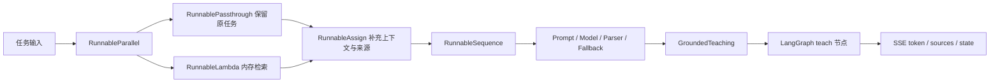

# LCEL 生产级组合与内存 RAG 设计文档

> **版本**: 1.0
> **状态**: completed
> **更新日期**: 2026-08-12

## 1 概述

本设计在现有五类 LCEL 任务链之上补齐高级组合、异步与流式执行、超时取消、运行追踪和 Runnable 图可视化，并让这些能力进入 Learning Coach 的真实教学路径。用户可以粘贴一段可选学习资料，系统在内存中切块和检索，讲解节点基于命中片段生成带来源的解释；没有资料时保持原流程。

LCEL 仍只负责一次任务的组合，LangGraph 继续负责诊断、人工输入、补救循环、暂停恢复和终止条件。

## 2 设计目标与非目标

### 2.1 设计目标

- 在实际教学任务中使用 `RunnableSequence`、`RunnableParallel`、`RunnableLambda`、`RunnablePassthrough` 和 `RunnableAssign`。
- 为任务层验证 `invoke`、`ainvoke`、`batch` 和 `stream` 四种统一执行入口。
- 对用户粘贴的纯文本资料执行确定性内存切块、关键词检索和来源回传，不依赖网络或额外模型。
- 为 Web 增加兼容现有 JSON 接口的 SSE 流式接口，并支持浏览器取消和服务端超时。
- 通过 RunnableConfig 传递任务名、会话 ID、标签和元数据，使可选 LangSmith 追踪有稳定语义。
- 提供 Runnable Mermaid 图导出，公开组合结构而不暴露 Prompt 内容、资料正文或密钥。
- 保持评分阈值、最大尝试次数、`interrupt()`、checkpointer 和 `thread_id` 语义不变。

### 2.2 非目标

- 不引入向量数据库、Embedding、外部 Retriever、重排、查询改写或 Hybrid RAG。
- 不增加文件上传、PDF/Word/网页解析、OCR、持久化语料库或跨进程会话。
- 不增加 WebSocket、用户账号、公网部署或分布式取消协议。
- 不让 LangSmith 成为必需依赖，也不在追踪元数据中保存学习资料、回答、模型输出或密钥。
- 不为展示并行而额外发起无业务价值的模型调用。

## 3 架构设计



教学链先用映射自动强制转换为 `RunnableParallel`，同时保留原始任务并检索资料；随后通过 `RunnableAssign` 增加格式化上下文和来源，再用显式 `RunnableSequence` 完成 Prompt、模型和解析。完整主链与完整备用链仍由 `with_fallbacks()` 包装。

LangGraph 使用 `stream_mode=["custom", "values"]`。文本节点在消费 Runnable `stream()` 时通过 `get_stream_writer()` 发出 token 和阶段事件，同时聚合完整文本写回 State；普通 `invoke()` 继续返回相同最终状态。

## 4 接口定义

### 4.1 学习资料与检索结果

```python
class StudySource(BaseModel):
    source_id: str
    text: str
    score: float

class GroundedTeaching(BaseModel):
    text: str
    sources: list[StudySource]
```

Web 创建会话新增可选 multipart 字段 `study_material`，最大 50,000 字符。资料在进入 State 前去除首尾空白并切成有界片段；来源 ID 使用稳定的 `material-1#chunk-N`，不会写入服务器文件。

### 4.2 Runnable 套件

`LearningCoachRunnables.teaching` 输出从 `str` 收敛为 `GroundedTeaching`，节点继续把 `text` 写入既有 `explanation`，并把来源写入新增的 `explanation_sources`。其余四个任务输出不变。

套件新增：

- `task(name)`：按白名单返回指定 Runnable。
- `draw_mermaid(name)`：调用 `get_graph().draw_mermaid()` 返回组合图。
- 稳定的 RunnableConfig 构造函数：包含 `run_name`、`tags` 和不含正文的 `metadata`。

### 4.3 SSE 接口

保留现有接口，同时新增：

| 接口 | 输入 | 输出 |
|------|------|------|
| `POST /api/sessions/stream` | multipart：`topic`、可选 `image`、可选 `study_material` | `text/event-stream` |
| `POST /api/sessions/{id}/answers/stream` | JSON：`answer` | `text/event-stream` |

事件统一使用 JSON data：

- `status`：节点或任务阶段变化。
- `token`：`task` 与 `text` 字段，供浏览器增量展示。
- `sources`：本轮讲解使用的来源列表。
- `state`：一次图执行结束后的完整 `SessionView`。
- `error`：可展示错误码和消息。
- `done`：本次 HTTP 流完成。

浏览器使用 Fetch + `ReadableStream` 解析 POST SSE，并通过 `AbortController` 取消。断连或取消会停止当前生成器；checkpointer 保留最近一次完整节点提交，不写入半截文本。

## 5 数据结构与状态

`LearningState` 新增：

- `study_material: str`：当前会话的可选纯文本资料。
- `explanation_sources: list[dict[str, Any]]`：最近一次讲解命中的资料片段。

`SessionView` 新增 `sources`，默认空列表。旧客户端忽略新增字段即可继续工作；旧 JSON 请求不提交 `study_material` 时行为保持兼容。

检索采用规范化词元和连续字符片段的确定性评分，按分数、原始顺序稳定排序，最多返回三个正分片段。无正分结果时返回空来源，并在 Prompt 中明确“没有可用参考资料”。

## 6 异步、超时、取消与错误处理

- 标准 Runnable 由 LangChain 提供 `ainvoke`；自定义 CLI 适配器允许在线程池中退化执行。
- 文本 Runnable 的 `stream` 聚合规则只接受文本或消息块；无法原生分块的模型产生一个完整文本块。
- Web SSE 每次图运行使用 `asyncio.timeout()`，超时由 `WEB_RUN_TIMEOUT_SECONDS` 控制，默认 120 秒且必须为正数。
- 请求断连、浏览器 Abort 或协程取消时传播 `CancelledError`，不包装成业务重试。
- 输入校验、未知会话、超时和模型失败使用稳定错误码；错误消息不包含资料正文、Prompt、回答或凭据。
- 主备模型回退次数仍有界；超时或取消不启动无限重试。

## 7 可观测性与安全边界

LangSmith 继续由 `LANGSMITH_TRACING` 和 `LANGSMITH_API_KEY` 控制，默认关闭；新增可选 `LANGSMITH_PROJECT=learning-coach`。图与 Runnable 调用传递以下安全元数据：

- `component=learning-coach`
- `task=diagnostic|teaching|quiz|assessment|summary`
- `session_id` 的本地随机标识
- `has_study_material`、`source_count` 等布尔值或计数

不得把学习资料、图片 base64、学习者回答、完整 Prompt、模型输出或 API Key主动复制到 metadata。Provider/LangSmith 自身是否记录输入输出由用户的 LangSmith 配置决定，README 必须提示这一边界。

Runnable Mermaid 图只描述步骤与边，不包含运行时输入。Web `/api/config` 继续只返回模型标识、能力和流式超时，不返回密钥。

## 8 验收标准

| ID | 场景 | Given | When | Then | Phase |
|----|------|-------|------|------|-------|
| C-1 | 高级组合 | 已创建任务套件 | 查看教学 Runnable 图并执行 | 图包含并行、透传、赋值、Lambda 和顺序组合，结果类型稳定 | Phase 1 |
| C-2 | 内存 RAG | 用户提供相关纯文本资料 | 执行讲解任务 | 只返回有界相关片段，Prompt 使用其正文，SessionView 返回来源 | Phase 1 |
| C-3 | 无资料兼容 | 用户未提供资料或无命中 | 完整运行学习流程 | 教学正常完成、来源为空且图协议不变 | Phase 1 |
| C-4 | 四种执行入口 | 使用离线流式 fake 模型 | 调用 invoke、ainvoke、batch、stream | 获得等价完整结果，batch 保序，stream 可增量聚合 | Phase 2 |
| C-5 | SSE 正常路径 | Web 会话请求成功 | 消费流式接口 | 收到有序 status/token/sources/state/done 事件 | Phase 2 |
| C-6 | 取消与超时 | 请求被取消或超过上限 | 执行流式图 | 运行停止、不写半截节点状态，并返回或记录稳定终止结果 | Phase 2 |
| C-7 | JSON 兼容 | 旧客户端使用原接口 | 创建会话并提交回答 | 响应仍可用，学习闭环行为不变 | Phase 3 |
| C-8 | 可观测性 | 追踪关闭或开启 | 调用不同任务 | 默认不要求 LangSmith；开启时标签稳定且显式 metadata 不含敏感正文 | Phase 3 |
| C-9 | 图可视化 | 请求已知或未知任务名 | 导出 Mermaid | 已知任务返回有效图，未知任务给出清晰错误 | Phase 3 |

## 9 设计决策记录与待确认事项

### 9.1 设计决策记录

- **D-1：选择确定性词法 Retriever。** 当前阶段要展示 LCEL RAG 组合，不提前引入 Embedding、外部存储和下一阶段的资料摄取复杂度。
- **D-2：并行用于 RAG 输入装配。** `RunnableParallel` 同时保留问题和执行检索，不为演示并行额外增加模型费用。
- **D-3：流式节点聚合后再写 State。** 浏览器先收到 token，LangGraph 只持久化完整结果，避免取消后留下半截讲解。
- **D-4：新增 SSE 而不替换 JSON。** 现有测试、调用方和非流式调试路径保持兼容。
- **D-5：取消采用请求生命周期。** 本地单进程 MVP 使用 Abort/断连传播，不增加跨进程运行注册表和取消 API。
- **D-6：资料只进入教学。** 诊断仍基于主题与可选图片，避免资料直接泄露答案；讲解阶段才使用检索证据。

### 9.2 用户决策

- 2026-08-12：选择方案 A，要求把两篇文章涉及的技术点尽量加入项目，并在代码完成后更新 `person` 目录的第 03 篇公众号文章。

### 9.3 待确认事项

- 无。向量检索、文件摄取和 Hybrid RAG 保留给后续文章与独立设计。

## 10 关联文档

- [原 LCEL Runnable 任务层设计](./lcel-runnable-task-layer-design.md)
- [Follow-up 实施计划](../plan/lcel-runnable-task-layer-follow-up-production-chain/implementation.md)
- [原实施计划](../plan/lcel-runnable-task-layer/implementation.md)
- [原交付复盘](../reports/2026-08-12-lcel-runnable-task-layer-assessment.md)
- [项目 README](../../README.md)
