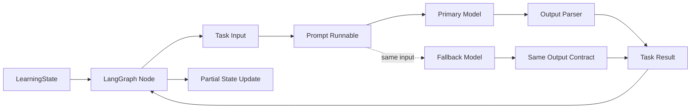

# LCEL Runnable 任务层设计文档

> **版本**: 1.0
> **状态**: active
> **更新日期**: 2026-08-12

## 1 概述

Learning Coach 当前由 LangGraph 节点直接拼接消息、调用模型并解析结果。本设计在模型套件与图节点之间增加 LCEL Runnable 任务层，把一次模型任务的 Prompt、模型、输出解析和有限回退组合成可复用单元。

职责边界保持清晰：LCEL 负责一次任务的输入到输出，LangGraph 继续负责跨步骤状态、条件路由、循环终止、人工输入和暂停恢复。

## 2 设计目标与非目标

### 2.1 设计目标

- 为诊断、讲解、出题、评价和总结提供显式、可独立调用的 Runnable。
- 让文本任务统一输出 `str`，结构化任务统一输出经过 Pydantic 验证的对象。
- 支持为教学角色和评价角色分别配置备用模型，并在完整任务链抛出异常时有限回退。
- 保持现有模型 Provider、CLI 登录态、结构化输出能力协商和图片 content block 能力。
- 保持现有 LangGraph 状态、节点名称、边、80 分阈值、最多两次评价以及 `interrupt()` 恢复协议不变。
- 保持 `build_learning_graph(model)` 和未配置备用模型时的既有行为兼容。

### 2.2 非目标

- 不增加 Agent 自主工具选择、RAG、文档解析、OCR 或持久化数据库。
- 不增加无限重试；每个任务最多尝试主 Runnable 和一个备用 Runnable。
- 不在回退时静默删除图片、降级输出 Schema 或改变学习状态。
- 不把 Prompt 或模型选择写入 LangGraph State。

## 3 架构设计



新增 `learning_coach.runnables` 模块，包含 Prompt、输入适配器、解析器、单任务 Runnable 构造函数和 `LearningCoachRunnables` 套件。`model.py` 仍是模型与能力协商的真理源；`nodes.py` 只把 State 投影成任务输入并把结果映射回局部 State 更新。

## 4 接口定义

### 4.1 `LearningCoachRunnables`

```python
@dataclass(frozen=True)
class LearningCoachRunnables:
    diagnostic: Runnable[dict[str, Any], Diagnostic]
    teaching: Runnable[dict[str, Any], str]
    quiz: Runnable[dict[str, Any], str]
    assessment: Runnable[dict[str, Any], Assessment]
    summary: Runnable[dict[str, Any], str]

    @classmethod
    def from_models(cls, models: LearningCoachModels) -> "LearningCoachRunnables": ...
```

每个任务接受普通字典，便于节点调用和离线测试；输出契约由字段类型固定。Runnable 原生提供 `invoke`、`batch`、`ainvoke` 等统一入口。

### 4.2 Prompt 输入

- `diagnostic`: `topic`、可选 `diagnostic_images`
- `teaching`: `topic`、诊断元数据、诊断回答、上次反馈和知识缺口
- `quiz`: `topic`、`explanation`
- `assessment`: `topic`、`quiz_question`、`quiz_answer`
- `summary`: `topic`、`score`、`feedback`、`missing_point`

诊断任务在 Prompt 前使用输入适配器构造可包含多张图片的 `HumanMessage`；其他任务直接使用 `ChatPromptTemplate`。

### 4.3 节点兼容接口

`LearningCoachNodes` 构造时从 `LearningCoachModels` 创建 Runnable 套件。各节点公开方法和返回的 State 字段不变，因此 `graph.py`、CLI 和 Web 的调用协议不变。

## 5 模型与配置结构

`ModelSettings` 新增两个可选字段：

- `chat_fallback_model_id`: 来自 `CHAT_FALLBACK_MODEL_ID`
- `assessment_fallback_model_id`: 来自 `ASSESSMENT_FALLBACK_MODEL_ID`；未设置时继承教学备用模型

`LearningCoachModels` 保存主模型、结构化主模型及对应的可选备用模型。每个备用结构化模型独立进行能力协商，不能复用主模型的 Structured Output 方法判断。

未配置备用模型时不包装 `with_fallbacks()`，以保持原行为和错误信息。相同模型 ID 在一次套件创建中只实例化一次。

## 6 输出解析与错误处理

文本任务使用 `StrOutputParser` 把 `AIMessage` 转为 `str`。诊断和评价继续优先使用模型的 `with_structured_output()`，之后增加显式 Pydantic 验证 Runnable，确保自定义适配器和测试替身也遵守 Schema。

回退包装位于完整的 `Prompt | Model | Parser` 之外。以下异常均可触发备用链：

- Provider 或官方 CLI 调用异常
- 超时或无效响应
- 输出解析异常
- Pydantic 验证失败

备用链使用相同输入和相同输出类型。备用链也失败时，遵循 LangChain `with_fallbacks()` 的原生语义，重新抛出最初的主链异常；不再次循环。图片输入原样传递，不为迁就不支持视觉的备用模型而静默删除。

## 7 兼容性与安全边界

- `MODEL_ID` 旧配置继续兼容。
- 两个 fallback 环境变量均为可选；空值不改变现有行为。
- CLI Provider 仍由官方客户端管理登录态，Runnable 层不读取或复制令牌。
- API Key、Prompt 输入和模型输出不得进入日志快照或测试固件。
- Web `/api/config` 只显示模型 ID 和能力，不返回密钥。
- LangGraph State 仍是学习流程数据的唯一真理源；Runnable 配置是运行时派生对象，不持久化到 State。

## 8 验收标准

| ID | 场景 | Given | When | Then | Phase |
|----|------|-------|------|------|-------|
| C-1 | 默认兼容 | 未配置 fallback 环境变量 | 创建模型套件 | 行为与当前版本一致 | Phase 1 |
| C-2 | 角色回退 | 配置教学和评价备用模型 | 主 Runnable 抛出异常 | 对应备用 Runnable 只执行一次并返回同类型结果 | Phase 2 |
| C-3 | 解析失败回退 | 主模型返回无效结构 | Pydantic 校验失败 | 完整任务切换到备用链 | Phase 2 |
| C-4 | LCEL 复用 | 构建任一任务 Runnable | 调用 `invoke` 或 `batch` | 获得稳定的任务输出契约 | Phase 2 |
| C-5 | 图行为保持 | 使用现有学习输入与两次 `Command(resume=...)` | 执行完整图 | 暂停点、路由、得分和总结行为不变 | Phase 3 |
| C-6 | 失败终止 | 主链和备用链都失败 | 调用任务 | 主链异常向上传播，且主备各执行一次 | Phase 2 |
| C-7 | 脱敏配置 | Web 服务已加载模型套件 | 请求 `/api/config` | 返回主/备用模型 ID 和图片能力，但不返回密钥 | Phase 3 |

## 9 设计决策记录与待确认事项

### 9.1 设计决策记录

- **D-1：回退完整任务链。** 如果解析阶段失败也应回退，因此 `with_fallbacks()` 包装完整 Runnable，而不是只包装模型。
- **D-2：结构化输出保留模型原生能力。** Provider 原生 Schema 和 Tool Strategy 比提示词 JSON 更可靠，LCEL 不用通用 JSON Parser 替换第二阶段的能力协商。
- **D-3：评价备用模型默认继承教学备用模型。** 用户只配置一个备用模型即可保护完整流程，同时仍可单独覆盖评价角色。
- **D-4：不把 Runnable 放入 State。** Runnable 是运行时依赖，State 只保存可检查、可恢复的学习数据。
- **D-5：主备均失败时保留主链异常。** 采用 `with_fallbacks()` 的原生错误语义，避免为了改写异常来源而增加自定义执行层。

### 9.2 用户决策

- 2026-08-12：选择方案 A，增加 `CHAT_FALLBACK_MODEL_ID` 与 `ASSESSMENT_FALLBACK_MODEL_ID`，让 CLI、Web 和 LangGraph 自动使用回退链。

### 9.3 待确认事项

- 无。本阶段不引入重试次数、异常白名单或按请求动态切换 fallback；这些能力如有需要另行设计。

## 10 关联文档

- [实施计划](../plan/lcel-runnable-task-layer/implementation.md)
- [单元测试计划](../plan/lcel-runnable-task-layer/unit-test-plan.md)
- [项目 README](../../README.md)
