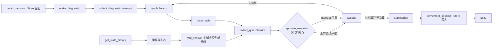

# 记忆、暂停恢复与 Time Travel 设计文档

> **版本**: 1.0
> **状态**: draft
> **更新日期**: 2026-08-15

## 1 概述

本模块为学习闭环补上"时间维度"的三项能力：可持久化的 Checkpoint（`CHECKPOINT_DB_PATH` 切换 SQLite 保存器，进程重启后按 `thread_id` 恢复任务）、跨会话长期记忆（LangGraph `Store` 沉淀学习者画像，并在新会话召回注入确定性摘要）与 Time Travel（列出会话检查点里程碑、从旧检查点分叉出新线程重新作答、并比较分叉前后的学习状态）。同时为唯一执行不可信输入的敏感动作——本地运行学习者代码——增加 `interrupt()` 审批闸门：未获批准时代码不进入执行器，评价返回明确的拒绝报告。

默认行为保持兼容：未配置数据库路径时仍使用进程内保存器与内存 Store；审批闸门默认开启，可通过 `CODE_EXECUTION_APPROVAL=false` 关闭。

## 2 设计目标

- `CHECKPOINT_DB_PATH` 指向 SQLite 文件时，图运行使用 `SqliteSaver`，CLI 可用 `--thread-id` 跨进程恢复未完成会话。
- `MEMORY_DB_PATH`（默认内存 Store）提供跨会话学习者记忆：会话结束写入画像（幂等键），会话开始召回并注入 `context_summary`。
- `list_session_checkpoints` 暴露有界、脱敏的里程碑列表；`fork_session` 从任意里程碑复制状态到新线程并重新进入对应中断点。
- `compare_learning_states` 输出分叉基线与当前状态的安全差异。
- 代码执行审批：`approve_execution` 节点在评价前 `interrupt()` 等待批准；拒绝时构造 `rejected` 报告，不启动子进程。
- 记忆写入以 `thread_id` 为幂等键，崩溃重放不会产生重复画像。

## 3 架构设计



### 3.1 数据流

1. `recall_memory` 在会话开始读取 `("learner_memory", learner_id)` 命名空间的画像摘要，写入 `long_term_memory`；`build_context_summary` 追加一行有界"长期记忆"描述。
2. 代码练习提交后，`approve_execution` 以稳定 payload 发起审批中断；恢复值为批准语义时写入 `execution_approved`，`assess` 正常运行受限执行器，否则构造 `rejected` 报告（零测试执行、零分、带一级提示与安全说明）。
3. `summarize` 完成后 `remember_session` 以 `session:{thread_id}` 为键写入本次结果并重算聚合画像；键稳定故崩溃重放幂等。
4. Time Travel 不修改原线程：`fork_session` 将快照 values 经 `update_state(新线程, as_node=前驱)` 复制，随后重新进入中断节点等待新输入。

### 3.2 真理源与兼容边界

- Checkpointer 仍是执行进度的唯一真理源；Store 只保存跨会话画像，两者不互相回写。
- `execution_approved` 是单轮审批结果，不跨轮次复用；每轮代码练习都需重新审批。
- 里程碑列表只暴露 checkpoint_id、节点、标签与安全摘要字段，不暴露隐藏测试、资料正文或向量。
- 分叉只复制状态，不复制审批：新线程在中断点重新等待输入与审批。
- 未配置持久化时的行为与第 10 阶段完全一致。

## 4 接口定义

```python
create_checkpointer(environ) -> Checkpointer        # InMemorySaver | SqliteSaver
create_memory_store(environ) -> BaseStore           # InMemoryStore | SqliteStore
execution_approval_enabled(environ) -> bool         # CODE_EXECUTION_APPROVAL，默认 true
recall_memory_node(state, config) -> dict           # 图节点
remember_session_node(state, config) -> dict        # 图节点
list_session_checkpoints(graph, config, limit=20) -> list[CheckpointMilestone]
fork_session(graph, config, checkpoint_id) -> ForkResult
compare_learning_states(before, after) -> dict      # 安全字段差异
```

`build_learning_graph(model, *, checkpointer=None, cache=None, retry_policy=None, enable_node_cache=None, store=None)` 新增 `store` 参数；Web/CLI 负责按环境构造并传入。

## 5 数据结构

```python
class CheckpointMilestone(BaseModel):   # checkpoint_id、node、label、stage、score/attempts 可选摘要
class LearnerMemoryView(BaseModel):     # sessions、topics、average_score、last_topic、last_missing_point
class ForkSummary(BaseModel):           # fork_session_id、checkpoint_id、baseline（对比摘要）
```

State 新增 `learner_id: str`、`long_term_memory: dict`、`execution_approved: bool`；`LearningEvent.node` 枚举扩展 `recall_memory`、`remember_session`。

## 6 错误处理与安全

- 审批拒绝不是错误：评价照常完成并路由补救/总结；拒绝报告不包含任何执行输出。
- Store/Checkpoint 打开失败按原语义抛出（配置错误快速失败）；节点内 Store 缺失时记忆节点为空操作。
- 幂等：记忆键含 `thread_id`；纯函数诊断节点已有缓存；审批与作答中断由 checkpointer 重放语义保证单次生效。
- 里程碑与画像不含密钥、API Key、隐藏测试、资料正文或学习者原始回答正文。
- SQLite 连接使用 `check_same_thread=False`（Store 另加 autocommit），由服务端单锁串行调用。

## 7 验收标准

- 配置 `CHECKPOINT_DB_PATH` 后，新进程用同一 `thread_id` 能从 pending 中断继续会话；未配置时行为不变。
- 会话完成后画像入库；新会话的 `context_summary` 包含长期记忆行；重复写入同一 thread 不产生重复条目。
- 代码练习在审批中断暂停；批准后测试正常执行，拒绝后得到零执行 `rejected` 报告并继续补救或总结。
- 里程碑列表有界且脱敏；从"练习作答前"分叉后，原线程状态不变，新线程重新等待作答；比较输出前后安全差异。
- 全量测试通过；非代码路径、零预算路径与文本评价不受影响。

## 8 设计决策记录

| ID | 决策 | 结论 | 理由 |
|----|------|------|------|
| D1 | 敏感动作范围 | 只审批本地代码执行 | 系统中唯一执行不可信输入的动作；其余节点均为只读或确定性 |
| D2 | 审批默认值 | 默认开启，可 env 关闭 | 与"受限执行器不是沙箱"的既有安全表述一致；关闭开关保留旧行为 |
| D3 | 持久化默认值 | 默认进程内，路径显式配置 | 不改变现有持久化语义；需要耐久的部署显式开启 |
| D4 | fork 实现 | 快照 values + `update_state(as_node=前驱)` 复制 | 实测跨线程 checkpoint_id 直连不携带源值；显式复制可控且不动原线程 |
| D5 | 记忆幂等键 | `session:{thread_id}` | 崩溃重放覆盖同一键；分叉线程天然产生新会话记录 |
| D6 | 记忆注入点 | 确定性 context_summary 追加行 | 不改 Prompt 模板与模型调用路径，行为变化可测 |

## 9 非目标

- 不实现多用户账号、鉴权或跨设备同步；learner_id 只是显式标识。
- 不做 Web 服务重启后的会话注册表恢复（检查点仍在磁盘，线程管理留待后续）。
- 不提供检查点删除、压缩或迁移工具。
- 不为非代码路径增加审批或确认步骤。

## 10 关联文档

- [实施计划](../plan/memory-time-travel/implementation.md)
- [实施 Checklist](../plan/memory-time-travel/implementation-checklist.md)
- [单元测试计划](../plan/memory-time-travel/unit-test-plan.md)
- [上一阶段设计文档](./multi-agent-orchestration-design.md)
