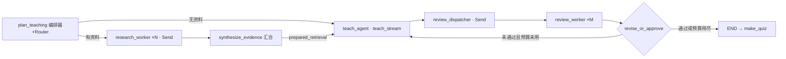

# 多 Agent 与任务编排设计文档

> **版本**: 1.0
> **状态**: completed
> **更新日期**: 2026-08-15

## 1 概述

本模块把讲解阶段升级为一个有界的多 Agent 编排子图：编排器（Orchestrator）按学习上下文制定教学计划并用 Router 决定 worker 集合；研究 Agent 按 `Send` 动态 fan-out 为多个薄弱点并行取证；教师 Agent 基于合并证据起草讲解；审查 Agent 再按维度 `Send` 并行审查，未通过时把审查意见作为 Handoff 交回教师 Agent 修订一次。子图作为主图 `teach` 节点接入（Subgraph），对外保持 `interrupt()` 协议、补救循环与练习 Agent 的既有行为不变。

默认所有 worker 均为确定性或复用现有 LCEL 任务：研究 Agent 使用现有 Hybrid/Graph 检索器，教师 Agent 复用 `teach_stream`（保留中间件、备用链与流式行为），审查 Agent 是离线规则检查，不新增模型 Provider 或环境变量。

## 2 设计目标

- 用一个编排节点按掌握度、资料与最近错误制定有界 `TeachingPlan`（焦点 ≤ 3、审查维度 ≤ 3、修订预算 ≤ 1）。
- 用 `Send` 实现按焦点数量的动态研究 fan-out 与按维度的并行审查 fan-out。
- 研究 → 教师 → 审查之间的证据、草稿与意见传递全部记录为 `AgentHandoff`，可追溯。
- 审查未通过时最多修订一次；修订后仍未通过则带意见接受，保证子图必然终止。
- 子图通过受限 `input_schema`/`output_schema` 与父图共享状态，事件只回传增量，不重复。
- 教师 Agent 复用现有教学 Runnable 与 Runtime Context 预算；工具型教学 Agent 路径行为不变。

## 3 架构设计



### 3.1 数据流

1. `plan_teaching` 依据是否有学习资料路由：无资料直接交给教师 Agent（跳过研究）；有资料按诊断重点、最近错误与知识缺口生成最多 3 个研究焦点，逐焦点 `Send` 给研究 Agent。
2. 研究Agent 对单个焦点运行现有 Hybrid/Graph 检索，返回该焦点的来源与报告增量；`synthesize_evidence` 合并去重来源（按分数取前 3）并构造 `prepared_retrieval` 移交给教师 Agent。
3. 教师Agent 通过 `teach_stream` 起草讲解：注入 `prepared_retrieval` 时 LCEL 链跳过内部检索，直接格式化研究证据；工具型 Agent 路径仍按需检索。
4. `review_dispatcher` 按计划维度 `Send` 审查 Agent：grounding（草稿与证据重叠）、clarity（长度边界）、alignment（回应缺口/错误），全部为确定性规则。
5. `revise_or_approve` 只看当前修订轮次的审查结论：存在未通过且预算未用完时，把意见并入反馈 Handoff 回教师 Agent；否则通过（或带意见接受）并结束子图。

### 3.2 真理源与兼容边界

- `TeachingPlan` 是本轮编排决策的唯一真理源；worker 只读取计划与移交证据，不得改写计划。
- `LearningRuntimeContext` 仍是模型/工具预算真理源；编排不新增任何预算入口。
- 讲解正文仍以教师 Agent 输出为准；审查只决定"接受或修订一次"，不直接改写草稿。
- 子图 `input_schema` 不包含事件类通道，`output_schema` 只回传增量与新字段，父图 Reducer 不会重复累加。
- `interrupt()` payload、补救路由、练习 Agent（`prepare_practice`）与缓存/重试挂接保持第 09 阶段语义。

## 4 接口定义

### 4.1 编排契约

```python
build_teaching_plan(state, runtime) -> TeachingPlan   # 确定性 Router
build_teaching_swarm(runnables, *, retriever) -> CompiledStateGraph
review_teaching_draft(draft, dimension, evidence, context) -> ReviewFinding
```

### 4.2 State 新通道

```python
teaching_plan: dict                                        # 单写者
research_evidence: dict                                    # 单写者（汇合节点）
teaching_reviews: Annotated[list[dict], append_teaching_reviews]   # 并行审查合并，保留最近 9 条
agent_handoffs: Annotated[list[dict], append_agent_handoffs]       # Agent 交接轨迹，保留最近 20 条
```

### 4.3 注入点

`runnables._retrieve_teaching_evidence` 优先返回任务输入中的 `prepared_retrieval`（`HybridRetrievalResult`），使 LCEL 教学链复用研究证据而不重复检索；未注入时行为与现状完全一致。

## 5 数据结构

```python
class ResearchFocus(BaseModel):    # label ≤ 50, query ≤ 300
class TeachingPlan(BaseModel):     # research_foci ≤ 3, review_dimensions ≤ 3, revision_budget ∈ {0,1}, uses_research
class ReviewFinding(BaseModel):    # dimension, round ≥ 0, passed, detail ≤ 200
class AgentHandoff(BaseModel):     # from_agent, to_agent, payload ≤ 200, reason ≤ 200
class ResearchEvidence(BaseModel): # foci 摘要 + 选中来源 ID + 主焦点报告
```

所有结构 `extra="forbid"`；Agent 名枚举为 `orchestrator / research / teach / review / practice / quiz`。

## 6 错误处理与安全

- 终止保证：子图固定为 计划 →（研究 fan-out ≤ 3）→ 汇合 → 教师 →（审查 fan-out ≤ 3）→ 判定；教师至多执行 `1 + revision_budget` 次，无其它循环。
- 审查为确定性规则，不存在模型误判导致的循环放大；修订意见只进入教学反馈，不修改评分阈值。
- 研究 Agent 沿用检索硬上限（每焦点候选 ≤ 8、来源 ≤ 3、尝试 ≤ 2）；合并来源总数仍 ≤ 3。
- Handoff 与审查记录均为有界、无正文摘要；不携带密钥、向量或学习者原始资料正文。
- 子图节点挂接与主图一致的瞬态重试；`interrupt()` 只存在于收集节点，编排不新增人工中断点。

## 7 验收标准

- 有资料主题：研究 worker 数量等于计划焦点数，证据合并去重且最多 3 个来源，教师收到 `prepared_retrieval`。
- 无资料主题：Router 跳过研究，直接进入教师 Agent，交接轨迹不含研究记录。
- 审查维度随掌握度与最近错误动态变化；并行审查结论按轮次合并，不依赖顺序。
- 草稿首次未通过时恰好修订一次；持续未通过时在预算耗尽后带意见接受，教师调用次数 ≤ 2。
- 父图 `learning_events` 等增量通道无重复累加；完整会话的 interrupt 恢复、补救循环与代码实践路径全部保持。
- 全量测试通过；Web 会话视图展示计划、审查结论与交接轨迹。

## 8 设计决策记录

| ID | 决策 | 结论 | 理由 |
|----|------|------|------|
| D1 | 编排范围 | 只编排讲解阶段，不动诊断/练习/评价 | 讲解是唯一同时需要研究、生成与质检的环节；外层闭环保持确定性 |
| D2 | worker 模型调用 | 只有教师 Agent 调模型 | 研究与审查复用确定性检索与规则，避免新增费用与不可控延迟 |
| D3 | 子图状态边界 | 受限 input/output schema，事件只回传增量 | 实测子图会把通道终值交给父图 Reducer；不隔离会重复累加 |
| D4 | 证据移交 | `prepared_retrieval` 注入教学链 | 复用 `_format_study_context` 与全部流式行为；未注入时行为不变 |
| D5 | 修订即 Handoff | 审查意见并入反馈，最多一次 | 有界修订展示 Handoff 语义，同时保证必然终止 |
| D6 | 练习 Agent | 保留现有节点并补记交接 | 第 08 阶段的练习管线已满足分工，不重复抽象 |

## 9 非目标

- 不引入跨 Agent 自由对话、群聊或开放协商；所有交接都是结构化单向移交。
- 不新增模型 Provider、外部编排服务、队列或持久化存储。
- 不改变评分阈值、尝试次数、预算上限与 `interrupt()` 协议。
- 不实现审查 Agent 的模型化评审（保留为确定性规则）。

## 10 关联文档

- [实施计划](../plan/multi-agent-orchestration/implementation.md)
- [实施 Checklist](../plan/multi-agent-orchestration/implementation-checklist.md)
- [单元测试计划](../plan/multi-agent-orchestration/unit-test-plan.md)
- [上一阶段设计文档](./langgraph-advanced-state-design.md)
