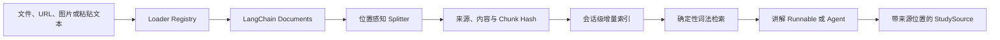

# 多模态学习资料摄取设计文档

> **版本**: 1.0
> **状态**: completed
> **更新日期**: 2026-08-14

## 1 概述

本设计把现有“粘贴一段纯文本再检索”的能力扩展为统一的多模态学习资料摄取管线。论文、书籍、课程文档、网页、图片和代码先经 Loader 转换为 LangChain `Document`，再按来源结构切块、补齐位置元数据、计算稳定哈希并写入会话级内存索引。讲解阶段继续使用确定性词法检索，但返回结果能够定位到原文件页码、幻灯片、章节、网页或代码行。

资料默认只存在于当前进程和学习会话中，不写入磁盘或外部数据库。第 6 阶段可以在不改变 Loader 和 Chunk 契约的前提下，把词法索引替换为 Hybrid RAG。

## 2 设计目标与非目标

### 2.1 设计目标

- 支持 PDF、DOCX、PPTX、EPUB、HTML、TXT、Markdown、常见代码文件、网页 URL 和 PNG/JPEG/GIF/WebP 图片。
- 使用统一 Loader 协议输出 LangChain `Document`，并保留文件名、URI、MIME、页码、幻灯片、章节、标题或代码行号。
- 使用位置感知 Splitter，在长内容切块后继续保留原始位置和块内偏移。
- 为来源、内容和 Chunk 计算 SHA-256，实现新增、更新、未变化跳过和删除的确定性增量索引语义。
- 图片通过已配置且支持视觉输入的主模型提取可检索的可见文字和图表语义；测试通过注入 fake 模型完成。
- Web 支持多文件和网页地址，CLI 支持可重复资料参数，同时兼容原 `study_material` 纯文本字段。
- 所有 Loader、网络读取、压缩文档和图片模型调用都有明确大小、数量和终止上限。

### 2.2 非目标

- 不引入数据库、持久化向量库、Embedding、重排、查询改写或 Hybrid RAG。
- 不把私人资料、图片正文或解析缓存默认写入服务器磁盘。
- 不支持任意压缩包、受密码保护文档、动态网页 JavaScript 渲染、站点爬取或递归链接抓取。
- 不承诺完整还原复杂排版、公式、扫描 PDF OCR 或视频音频转写。
- 不改变评分阈值、最大补救次数、`interrupt()`、checkpointer 和 `thread_id` 语义。

## 3 架构设计



Loader Registry 只负责选择解析器。每个 Loader 输出一个或多个结构化 `Document`，正文位于 `page_content`，统一元数据位于 `metadata`。Splitter 不重新解释文件格式，只在 Loader 已确定的页、幻灯片、章节、段落或代码范围内切分。增量索引以逻辑 `source_key` 识别同一来源，以 `content_hash` 判断是否变化，以 `chunk_hash` 去重并稳定排序。

图片 Loader 是唯一允许调用模型的摄取路径。它复用当前主聊天模型和标准图片 content block，最多调用一次生成有界的可见文字与图表描述；模型不支持视觉输入时明确拒绝图片资料，不以文件名伪造理解结果。

## 4 接口定义

### 4.1 统一资料输入

```python
@dataclass(frozen=True)
class MaterialInput:
    source_name: str
    mime_type: str
    data: bytes | None = None
    source_url: str | None = None
```

本地文件和 Web 上传使用 `data`；网页使用 `source_url`。二者必须且只能提供一个。Loader Registry 根据 MIME、扩展名和 URL Content-Type 选择解析器，不信任单一客户端字段。

### 4.2 统一元数据

每个 `Document.metadata` 至少包含：

- `source_id`：当前会话内稳定、不可逆的来源标识。
- `source_key`：同一逻辑来源的规范化键，用于增量替换。
- `source_type`：`pdf|docx|pptx|epub|html|text|code|web|image`。
- `source_name`、`source_uri`、`mime_type`。
- `content_hash`：原始输入 SHA-256。
- `location_type` 与 `location`：页码、幻灯片、章节、标题、段落或行号描述。
- 可选结构字段：`page`、`slide`、`chapter`、`heading`、`line_start`、`line_end`。

Chunk 在上述字段基础上增加 `chunk_id`、`chunk_hash`、`chunk_index`、`char_start` 和 `char_end`。所有返回给浏览器的 URI 只允许文件名或原始 http/https URL，不返回服务器绝对路径。

### 4.3 Loader 协议

```python
class MaterialLoader(Protocol):
    def supports(self, material: MaterialInput) -> bool: ...
    def load(self, material: MaterialInput) -> list[Document]: ...
```

具体 Loader：

- PDF：逐页提取，位置为 `page N`。
- DOCX：按标题和段落提取，位置为段落序号。
- PPTX：按幻灯片提取，位置为 `slide N`。
- EPUB：按 spine 章节提取，位置为章节名。
- HTML/网页：移除脚本样式，按标题和正文块提取，位置保留 URL 与 heading。
- TXT/Markdown：按文本结构提取。
- 代码：按行切分，保留语言、路径与起止行。
- 图片：调用视觉模型生成文字与图表描述，位置为图片文件名。

### 4.4 增量索引

```python
class InMemoryStudyIndex:
    def sync(
        self,
        documents: Sequence[Document],
        *,
        cleanup: Literal["incremental", "full"] = "incremental",
    ) -> IngestionReport: ...

    def search(self, query: str, *, top_k: int = 3) -> list[StudySource]: ...
```

同一 `source_key + content_hash` 再次写入时跳过；同一 `source_key` 内容变化时仅替换该来源 Chunk；`full` 模式删除本轮未出现来源，`incremental` 模式保留它们。报告只返回来源名、哈希前缀、计数和错误，不返回完整正文。

## 5 数据结构与兼容边界

`LearningState` 新增序列化后的 `study_chunks` 与 `ingestion_report`。原 `study_material` 字段继续保留：它会被包装成 `pasted-text` 来源并进入相同 Splitter/Index 管线。`StudySource` 增加可选的来源名、URI、类型、位置和 Chunk 哈希，原只读取 `source_id/text/score` 的调用方继续兼容。

Web 创建会话增加多个 `materials` 文件字段和换行分隔的 `source_urls` 字段。CLI 增加可重复的 `--material PATH_OR_URL`。诊断图片 `--image` 仍只参与诊断；作为学习资料摄取的图片使用 `--material`，二者语义不混用。

## 6 错误处理与安全边界

- 单文件、文件数量、总字节数、提取字符数、网页响应和图片数量均设置硬上限。
- 上传文件根据扩展名、声明 MIME 和文件签名做一致性检查；不支持类型明确报错。
- 网页只允许 http/https，禁止凭据 URL，并阻止 loopback、私网、链路本地、保留地址和非 HTTP 重定向。
- PDF/Office/EPUB 解析异常转换为包含来源名但不包含正文的用户错误。
- 图片仅在模型能力明确支持时调用；每张图最多一次，失败不无限重试。
- 代码 Loader 只读取文本，不执行、导入、格式化或编译用户代码。
- 日志、Context Report、LangSmith metadata 和增量报告不复制资料正文、图片 base64 或绝对本地路径。

## 7 切分、哈希与检索规则

- 默认 Chunk 目标长度 1,000 字符、重叠 150 字符；代码优先在行边界切分，其他内容优先标题、段落和句子边界。
- `source_id = sha256(source_key)`；`content_hash = sha256(raw input)`；`chunk_hash = sha256(source_id + location + normalized chunk text)`。
- 哈希使用完整十六进制值做内部比较，对外报告可显示短前缀。
- 检索继续使用中英文确定性词法评分，按分数、来源顺序、Chunk 顺序稳定排序。
- 同一 Chunk 只保留一个索引记录；来源变化时旧 Chunk 必须从搜索结果中消失。

## 8 验收标准

| ID | 场景 | Given | When | Then | Phase |
|----|------|-------|------|------|-------|
| M-1 | 多格式 Loader | 提供支持的论文、书籍、课件和代码 | 执行摄取 | 生成非空 Document，并包含格式对应位置 | Phase 1 |
| M-2 | 网页与图片 | 提供安全网页或视觉图片 | 执行摄取 | 网页正文或视觉描述进入 Document，非法 URL/无视觉能力明确失败 | Phase 1 |
| M-3 | 位置感知切块 | Document 超过 Chunk 上限 | 执行 Splitter | Chunk 有界、顺序稳定并保留页码/章节/行号 | Phase 2 |
| M-4 | 哈希增量 | 同一来源重复、修改或删除 | 同步索引 | 分别报告 skipped、updated、deleted，旧 Chunk 不再命中 | Phase 2 |
| M-5 | 检索兼容 | 同时存在新资料与旧纯文本 | 执行讲解检索 | 返回带位置的来源，旧无资料流程保持可用 | Phase 2 |
| M-6 | CLI 摄取 | 用户重复传入 `--material` | 启动学习流程 | 文件和 URL 被摄取，诊断暂停恢复语义不变 | Phase 3 |
| M-7 | Web 摄取 | 用户上传多文件并填写网页 | 创建流式或 JSON 会话 | 页面展示摄取统计和讲解来源位置，敏感正文不进入报告 | Phase 3 |
| M-8 | 有界失败 | 输入超限、格式损坏或来源不安全 | 执行摄取 | 请求有限失败、错误清晰且不泄漏内容 | Phase 3 |

## 9 设计决策记录与用户决策

### 9.1 设计决策记录

- **D-1：使用会话级内存索引。** 保持当前本地 MVP 隐私边界，不引入数据库与资料删除迁移协议。
- **D-2：统一输出 LangChain Document。** Loader 与后续 Retriever 解耦，第 6 阶段可替换索引而不重写解析器。
- **D-3：自有 Loader Registry 配合专用解析库。** 避免引入完整 `langchain-community` 依赖树，同时保留 LangChain Document 契约。
- **D-4：图片使用视觉模型而非伪 OCR。** 图表、公式和结构信息需要多模态理解；无视觉能力时显式失败。
- **D-5：哈希覆盖来源、原始内容和 Chunk。** 分离逻辑身份、版本判断和切块去重，保证更新语义可解释。
- **D-6：旧纯文本资料继续兼容。** 旧 Web/API/测试不需要迁移，新资料统一走同一索引路径。

### 9.2 用户决策

- 2026-08-14：用户确认方案 A，采用会话内存增量索引、视觉模型图片解析和多格式 Loader，不引入 SQLite 或其他持久化数据库。

### 9.3 待确认事项

- 无。持久化语料库、扫描 PDF OCR、音视频转写与 Hybrid RAG 留给后续独立设计。

## 10 关联文档

- [实施计划](../plan/multimodal-material-ingestion/implementation.md)
- [上一阶段 Context Engineering 设计](./context-engineering-middleware-design.md)
- [LCEL 生产级组合与内存 RAG](./lcel-production-chain-design.md)
- [项目 README](../../README.md)
