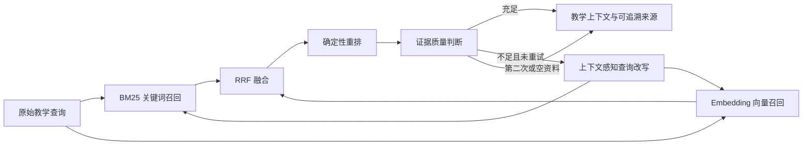

# 自校正 Hybrid RAG 设计文档

> **版本**: 1.0
> **状态**: completed
> **更新日期**: 2026-08-14

## 1 概述

本设计把现有确定性词法检索升级为可追溯、自校正且有明确终止条件的 Hybrid RAG。系统在会话级内存 Chunk 上同时执行关键词与 Embedding 召回，通过 Reciprocal Rank Fusion（RRF）融合候选，再以确定性规则重排并判断证据质量。证据不足时，检索器结合学习主题、诊断重点、反馈和知识缺口改写查询，并且最多再检索一次。

默认 Embedding 为无网络、无费用的本地确定性特征哈希实现；用户可以显式配置 LangChain 支持的 Provider Embedding 获得更强的语义能力。Provider 调用失败时降级为关键词检索，教学流程仍可继续。

## 2 设计目标与非目标

### 2.1 设计目标

- 在现有 `study_chunks` 和兼容纯文本 Chunk 上实现关键词与向量双路召回。
- 关键词侧使用 BM25，向量侧使用余弦相似度，两个排序通过 RRF 融合。
- 对融合候选进行有界二阶段重排，稳定选出最多三个教学证据。
- 基于相关度、查询覆盖率和来源多样性判断证据是否足够。
- 证据不足时执行一次上下文感知查询改写和再次检索；所有路径最多两次检索。
- 返回原始查询、最终查询、每次尝试、各阶段分数、质量结论和降级信息。
- 默认不需要 API Key；可选 Provider Embedding 通过依赖注入和环境配置启用。
- 保留文件名、URI、页码、章节、幻灯片、标题、代码行号和 Chunk Hash。

### 2.2 非目标

- 不引入数据库、持久化向量库、外部搜索引擎或跨进程 Embedding 缓存。
- 不增加 LLM 查询改写、LLM 证据评分或托管 Reranker 调用。
- 不让检索重试进入 LangGraph 教学补救循环；检索循环独立且最多一次改写。
- 不承诺默认本地哈希 Embedding 达到神经网络语义模型的效果。
- 不改变 80 分通过阈值、最多两次评价、`interrupt()`、checkpointer 或 `thread_id` 语义。

## 3 设计决策记录

### 3.1 Embedding 采用本地默认、Provider 可选

默认 `EMBEDDING_MODEL_ID=local:hash-v1`，使用稳定的中英文词元和字符 n-gram 做有符号特征哈希并归一化。该实现可重复、无网络、适合测试和 CLI 登录模式。其他 `provider:model` 标识交给 LangChain `init_embeddings()`，并通过统一 Embeddings 接口注入检索器。

本地模式主要补充模糊词形和局部表达相似度，不伪装成完整语义模型。需要更强语义召回时，用户必须显式选择 Provider，并承担对应延迟、费用和数据边界。

### 3.2 Hybrid 使用 BM25 + Dense + RRF

BM25 保留精确术语、API 名称和代码标识符，Dense 召回补充表达变化。两个通道各自只保留有正相关度的有界候选，RRF 只依赖排名而不是直接混合不可比较的原始分数。Embedding 通道失败时，融合器只使用 BM25 排名并记录降级原因。

### 3.3 重排与质量判断保持确定性

重排综合归一化 RRF、查询词覆盖、连续短语命中、来源位置和通道一致性，不额外调用模型。质量判断使用最高重排分、覆盖率、有效候选数量和来源数量，输出 `sufficient|insufficient|empty` 以及机器可读原因。

### 3.4 自校正循环最多两次检索

第一次证据不足时，改写器删除低信息词，补入主题、诊断重点、反馈、知识缺口和最近错误中的高信息词，并保留原查询。只允许一次改写；第二次无论质量如何都终止，返回当前最佳证据和质量报告。若无资料或查询为空则不改写。

### 3.5 追溯信息是公开结果的一部分

`StudySource` 增加可选的关键词、向量、融合和重排分数及命中尝试编号；`GroundedTeaching` 增加可选 `RetrievalReport`。旧调用方只读取原字段时保持兼容。Web 仅展示查询、分数、模式和来源位置，不展示未选中的资料正文或 Embedding 向量。

## 4 架构设计



`HybridStudyRetriever` 是唯一编排入口，内部依次调用关键词召回、Embedding 召回、RRF、Reranker、QualityJudge 和 QueryRewriter。它缓存当前进程中按 `(embedding_model_id, chunk_hash)` 标识的文档向量；查询向量不持久化。所有组件均可注入 fake，测试不访问真实网络或模型。

## 5 接口定义

### 5.1 Embedding 配置

```python
@dataclass(frozen=True)
class RagSettings:
    embedding_model_id: str = "local:hash-v1"
    candidate_k: int = 8
    top_k: int = 3
    max_attempts: int = 2
```

`embedding_model_id` 为空或不合法时启动失败并给出明确配置错误。`max_attempts` 固定为 2，不开放浏览器参数。

### 5.2 检索接口

```python
class HybridStudyRetriever:
    def retrieve(
        self,
        query: str,
        chunks: Sequence[StudyChunkRecord],
        *,
        rewrite_context: Mapping[str, Any] | None = None,
    ) -> HybridRetrievalResult: ...
```

原有 `retrieve_study_sources(values, ...)` 保留，内部适配纯文本资料后委托 Hybrid 检索器。`LearningCoachRunnables` 和 `ContextEngineeredTeaching` 接收同一个可注入检索器，避免 LCEL 与 Agent 使用不同策略。

## 6 数据结构

- `RetrievalScore`：`keyword`、`embedding`、`fusion`、`rerank` 四类 0..1 分数。
- `RetrievalAttempt`：尝试编号、查询、关键词/向量候选数、选中数量、质量结论、原因和降级信息。
- `RetrievalReport`：原始查询、最终查询、是否改写、最终质量、尝试列表和 Embedding 模式。
- `HybridRetrievalResult`：最终 `StudySource` 列表和 `RetrievalReport`。

报告只包含安全元数据和查询，不包含未选中正文、向量、API Key 或本地绝对路径。

## 7 错误处理与资源边界

- Provider Embedding 初始化配置错误在启动时失败，不静默换模型。
- Provider 文档或查询 Embedding 调用失败时，本轮降级到 BM25，并把异常归一化为安全原因，不回显密钥或正文。
- Embedding 维度不一致、非有限数值或空向量视为通道失败。
- 单路候选默认最多 8 个，最终证据最多 3 个，检索尝试最多 2 次。
- 文档向量缓存最多 2,048 项，按插入顺序淘汰，不跨进程持久化。
- 无正相关候选时返回空来源和 `empty`，教学 Prompt 明确说明没有可用证据。

## 8 验收标准

| ID | 场景 | Given | When | Then | Phase |
|----|------|-------|------|------|-------|
| H-1 | 本地 Embedding | 未配置外部模型 | 创建检索器并重复计算 | 向量稳定、归一化且无网络调用 | 1 |
| H-2 | 双路召回 | 资料含精确术语和表达变体 | 执行一次检索 | BM25 与 Dense 均产生有界候选并可追溯 | 2 |
| H-3 | 融合重排 | 两路候选顺序不同 | 执行 RRF 与重排 | 得分归一化、排序稳定且最多返回 top_k | 2 |
| H-4 | 自校正成功 | 首轮覆盖率不足 | 执行 Hybrid 检索 | 查询改写一次、再次检索并返回两次尝试 | 3 |
| H-5 | 循环终止 | 两轮证据仍不足 | 执行 Hybrid 检索 | 第二轮后终止，不产生第三次检索 | 3 |
| H-6 | Embedding 降级 | Embedding 后端抛出异常 | 执行检索 | BM25 结果可用且报告标记 degraded | 3 |
| H-7 | 教学集成 | LCEL 或 Agent 使用结构化 Chunk | 生成讲解 | Prompt、来源和 Web 均携带最终检索报告 | 4 |
| H-8 | 旧接口兼容 | 仅提供 `study_material` | 调用原公开函数 | 仍返回来源且不要求新配置 | 4 |

## 9 待确认事项

无。用户已选择方案 A：本地确定性 Embedding 为默认，Provider Embedding 仅作为显式可选项。

## 10 关联文档

- [多模态学习资料摄取设计](./multimodal-material-ingestion-design.md)
- [LCEL 生产级组合设计](./lcel-production-chain-design.md)
- [Context Engineering 与 Middleware 设计](./context-engineering-middleware-design.md)
- [实施计划](../plan/self-corrective-hybrid-rag/implementation.md)
