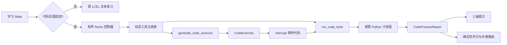

# Tool Calling、ReAct 与代码实践设计文档

> **版本**: 1.0
> **状态**: completed
> **更新日期**: 2026-08-15

## 1 概述

本模块在现有有界教学 Agent 和 LangGraph 学习闭环中增加代码实践能力：通过带 Pydantic 参数 Schema 的 LangChain Tool 生成练习、执行本地测试，并把执行结果归类为可追溯错误，再生成逐级提示。代码实践控制器采用有界 ReAct 结构，每轮只允许从当前阶段开放的工具中选择动作，记录 Action、Observation 和终止原因。

默认方案是本地受限 Python 执行器。它通过 AST 策略、独立临时目录、隔离 Python 模式、最小环境、超时、资源限制和输出上限降低风险，但不把进程级纵深防护表述为能安全承载恶意代码的强沙箱。

## 2 设计目标

- 为练习生成和代码测试提供显式、可校验的工具输入与输出 Schema。
- 根据学习阶段、主题、工具预算和已有练习动态开放最小工具集合。
- 使用有界 ReAct 控制器组织 Action、Observation、错误处理和确定性终止。
- 生成可执行的 Python 函数练习，测试用例由服务端练习对象持有。
- 在临时目录中受限运行代码，并区分语法、策略、超时、资源、运行时和断言失败。
- 根据错误类型与失败上下文提供三级提示，不直接泄露完整参考答案。
- 将练习、执行报告、工具轨迹和提示接入 State、暂停恢复、SSE 与 Web。
- 保持现有文本练习兼容；不适合代码实践或预算为零时继续使用原 LCEL 练习和评价。

## 3 架构设计

### 3.1 数据流

1. `make_quiz` 根据主题、教学内容和工具预算判断是否进入代码实践。
2. 动态注册表在生成阶段只开放 `generate_code_exercise`，在评价阶段只开放 `run_code_tests`。
3. 有界控制器验证工具名、参数 Schema 和剩余调用次数，执行一次 Action 并保存安全 Observation。
4. `collect_quiz` 继续使用原 `interrupt()`；代码练习只向 payload 增加可选结构化字段。
5. `assess` 对代码练习使用确定性测试报告评分，对文本练习继续使用现有结构化模型评价。
6. 报告写入 State，并通过 JSON/SSE 与 Web 展示测试统计、错误类别、提示层级和工具轨迹。

### 3.2 真理源与兼容边界

- `CodeExercise.tests` 是本轮代码测试的运行时真理源；模型文本和浏览器不能修改测试定义。
- `LearningRuntimeContext.tool_call_limit` 仍是服务端工具预算真理源；工具轨迹只是运行结果，不得回写预算。
- `CodePracticeReport.score` 来自通过测试数与总数的确定性计算，不由模型自由文本覆盖。
- 新增 State 与 Web 字段均为可选；没有 `code_exercise` 时完全沿用原文本练习路径。
- 练习和报告只存在于当前会话内存，不写入资料索引、原始文件或跨会话存储。

## 4 接口定义

### 4.1 工具 Schema

`generate_code_exercise` 接收有界 `topic`、`explanation` 和难度，返回 `CodeExercise`。`run_code_tests` 接收 `CodeExercise` 与学习者代码，返回 `CodePracticeReport`。所有工具参数使用 `extra="forbid"` 的 Pydantic 模型，未知字段、超长代码和非法测试结构在执行前拒绝。

### 4.2 动态工具注册表

注册表根据 `stage=generate|evaluate`、主题适用性、是否已有练习和剩余预算选择工具：

- `generate`：只开放练习生成工具。
- `evaluate`：只有存在服务端练习时才开放测试工具。
- 预算为零、阶段未知或输入不完整：不开放工具并走兼容路径或明确终止。

### 4.3 有界 ReAct 控制器

控制器每轮包含 `Action -> validated Tool -> Observation`，并具有以下硬终止条件：

- 单次任务工具调用数不超过 Runtime Context 上限，且代码实践内部绝不超过 3 次。
- 同一规范化 Action 不重复执行。
- 工具不存在、参数校验失败或执行返回终止错误时立即结束。
- 生成阶段得到一个练习即结束；评价阶段得到一个执行报告即结束。

### 4.4 受限执行器

执行器只支持单文件 Python 函数练习：

- 先执行 `ast.parse`，拒绝 import、dunder 属性和文件、网络、动态执行、反射等危险能力。
- 代码与测试 Runner 写入一次性临时目录，使用当前解释器的 `-I -S` 隔离模式启动。
- 子进程使用最小环境、固定工作目录、墙钟超时、CPU/内存/文件/进程/描述符限制。
- stdout/stderr 和报告字段均截断；向外只返回安全错误摘要，不返回临时绝对路径或宿主环境。
- 每个测试调用练习声明的函数并对 JSON 可表示的参数和结果做相等比较。

本执行器不提供容器、虚拟机、内核级网络隔离或多租户恶意代码承载能力。公网部署前必须替换为专用隔离执行服务。

## 5 数据结构

- `CodeTestCase`：测试 ID、JSON 参数、期望值和是否可见。
- `CodeExercise`：练习 ID、标题、说明、入口函数、Starter Code、难度和有界测试。
- `CodeTestOutcome`：单测状态、耗时和安全摘要。
- `CodeHint`：`level=1|2|3`、错误类型和提示正文。
- `CodePracticeReport`：状态、错误类型、通过数、总数、分数、测试结果、提示和安全边界说明。
- `ToolTraceEntry`：步骤、工具、状态和不含代码正文的 Observation 摘要。
- `CodePracticeRun`：练习或执行报告、轨迹、调用次数、上限和终止原因。

## 6 错误处理与安全

| 错误类型 | 行为 | 评分与提示 |
|----------|------|------------|
| `syntax_error` | AST 解析失败，不启动子进程 | 0 分，指出语法类别与安全行号 |
| `policy_violation` | 命中禁止节点、名称或属性 | 0 分，解释允许的函数练习边界 |
| `timeout` | 超过墙钟时间并终止子进程 | 保留已确认结果，否则 0 分；提示循环与复杂度 |
| `resource_limit` | 资源限制或进程异常退出 | 不暴露系统异常正文；提示内存/输出/递归风险 |
| `runtime_error` | 函数调用抛出异常 | 按已通过比例评分；提示异常类型和测试位置 |
| `test_failure` | 返回值与期望不一致 | 按通过比例评分；逐级从边界类别到修复范式 |
| `passed` | 全部测试通过 | 100 分，不生成修复提示 |

任何异常都转为结构化报告。服务端日志和返回值不得包含 API Key、完整环境变量、临时目录或未截断的学习者代码。

## 7 验收标准

| ID | 场景 | Given | When | Then | Phase |
|----|------|-------|------|------|-------|
| C-1 | 工具 Schema | 工具参数包含未知字段或超长代码 | 调用工具 | Pydantic 在执行前拒绝且不启动代码进程 | 1 |
| C-2 | 动态选择 | 处于生成或评价阶段 | 查询可用工具 | 只返回当前阶段所需工具；预算为零时为空 | 1 |
| C-3 | 调用上限 | 控制器尝试重复或超预算调用 | 执行 ReAct | 以明确原因终止且无无限循环 | 2 |
| C-4 | 安全执行 | 代码包含 import、open、dunder 或无限循环 | 运行测试 | 分别得到策略违规或超时，且无宿主路径泄漏 | 2 |
| C-5 | 错误分类 | 代码存在语法、运行时或断言错误 | 运行测试 | 返回对应错误类型、通过统计和稳定评分 | 2 |
| C-6 | 分级提示 | 测试未全部通过 | 生成报告 | 返回由方向到修复范式的最多三级提示，不给完整答案 | 3 |
| C-7 | 学习流程 | 代码主题进入练习阶段 | 提交代码 | State、SSE、Web 展示练习与报告，补救路由使用确定性分数 | 4 |
| C-8 | 兼容降级 | 非代码主题或工具预算为零 | 运行学习闭环 | 原 LCEL 练习与模型评价保持不变 | 4 |

## 8 设计决策记录

- **D-1：选择本地受限 Python 执行器。** 无新增外部服务和部署前置，适合本地教学 MVP；文档明确它不是强隔离沙箱。
- **D-2：确定性测试评分优先于模型评分。** 可复现、可测试，并避免模型忽略真实执行结果。
- **D-3：ReAct 采用有界控制器。** Tool Calling 保留显式 Schema 和动态选择，但不允许开放式自主循环。
- **D-4：代码实践是兼容分支。** 不适用主题继续走已有文本练习，避免把所有知识点强行改造成 Python 题。
- **D-5：首版只支持 Python 函数练习。** 多语言执行与强隔离服务属于后续能力。

## 9 非目标

- 不支持任意 Shell、包安装、网络访问、多文件工程或交互式 stdin。
- 不构建容器集群、在线判题平台、账号系统或跨会话题库。
- 不自动执行上传资料中的代码。
- 不把本地执行器用于不可信多租户或公网恶意代码。

## 10 关联文档

- [Context Engineering 与 Middleware](./context-engineering-middleware-design.md)
- [GraphRAG 与知识前置图](./graphrag-prerequisite-graph-design.md)
- [实施计划](../plan/tool-calling-react-code-practice/implementation.md)
- [单元测试计划](../plan/tool-calling-react-code-practice/unit-test-plan.md)
